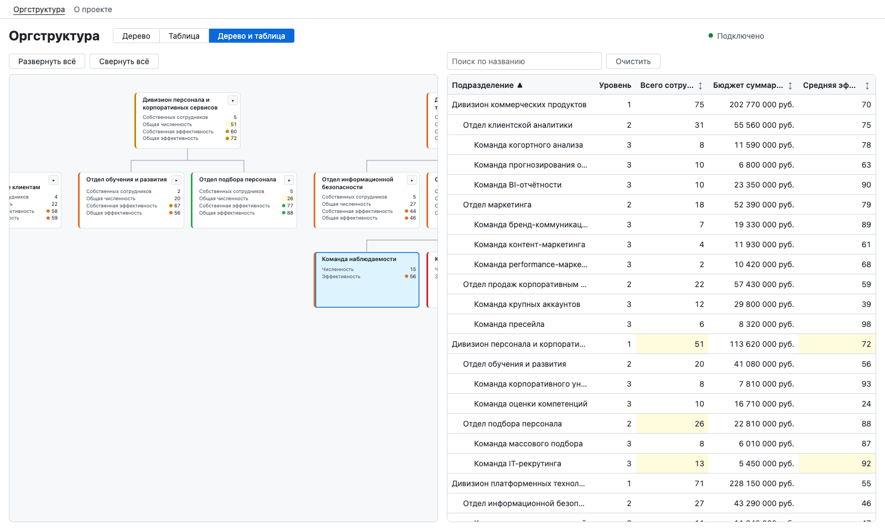
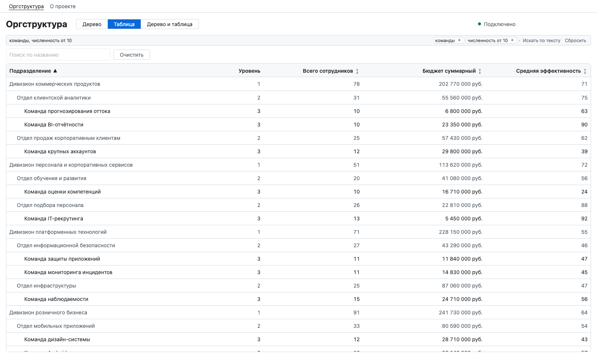
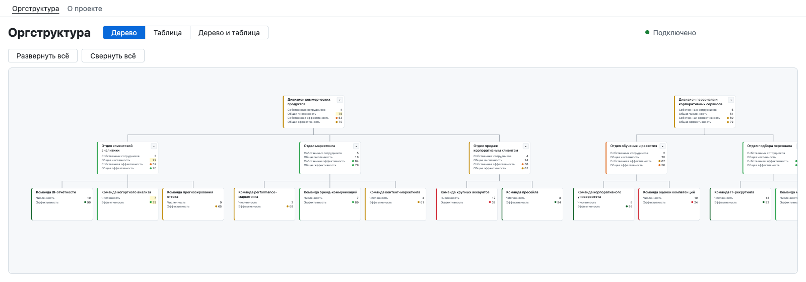

# Оргструктура: интерактивное дерево

> Черновик. Подробности и доказательства — в `docs/ai-log/`, план сведения — `docs/requirements/readme.md`.

Дерево подразделений `{ id, name, parentId, headcount, budget, performance, updatedAt, matches, order }`:
загрузка через многоключевой слой кеширования со stale time 5 секунд, валидация ответа на
клиенте, раскрытие и скрытие ветвей, панорама и зум, состояния загрузки, ошибки и пустого
ответа. Эндпоинт принимает поиск и серверную сортировку. Рядом с деревом — аналитическая
таблица подразделений, сгруппированная по иерархии: фильтр по названию, серверная сортировка
по заголовкам внутри групп, выбор строки.
Три режима просмотра — дерево, таблица, оба рядом; фильтр, сортировка и режим живут в адресной
строке. Выделение общее: строка таблицы раскрывает ветку и доводит холст до узла, узел дерева
выделяет и прокручивает строку; несовпавшие с фильтром узлы дерева приглушены, пока таблица на
экране. Изменения данных приходят с сервера потоком и применяются без перезапроса, изменённые
значения подсвечиваются; AI-поиск переводит фразу («команды численностью больше 10») в фильтр
таблицы. Скриншоты — [ниже](#скриншоты).

## Запуск

Одной командой, нужен только Docker:

```sh
docker compose up --build   # http://localhost:8080
```

`.env` не обязателен: без него действуют умолчания, генерация патчей стартует сама. Подробности —
[«Запуск в Docker»](#запуск-в-docker).

Для разработки нужен Node ≥ 22.22 (в репозитории `.nvmrc` → 24):

```sh
npm install
npm run dev            # мок-API :3001 + Vite :5173
```

| Команда                              | Что делает                  |
| ------------------------------------ | --------------------------- |
| `npm run typecheck` / `npm run lint` | `lerna run` по всем пакетам |
| `npm test`                           | vitest по всему репозиторию |
| `npm run test:mutation`              | мутационная проверка тестов |
| `npm run build -w @app/web`          | production-сборка           |
| `npm run check:size`                 | бюджет gzip сборки клиента  |

Состояния UI проверяются адресом страницы — мок-сервер читает дев-параметры из `Referer`,
клиент про них не знает: `/?scenario=empty`, `/?scenario=error`, `/?scenario=invalid`,
`/?delay=3000`. Изменить данные: `curl -X POST localhost:3001/api/dev/touch`
(`?mode=delete` — удалить случайный лист).

Эндпоинт: `GET /api/org-tree?q=<строка>&sort=<колонка>&dir=<asc|desc>`, по умолчанию
`sort=name&dir=asc`. Всегда возвращаются все узлы; от параметров зависят только `matches`
(совпадение `q` с собственным именем, без учёта регистра) и `order` (сквозная позиция в
серверной сортировке). `sort`: `name`, `level`, `totalHeadcount`, `totalBudget`,
`totalPerformance`. Невалидный параметр — 400 со списком проблем.

Эндпоинт: `POST /api/search/parse`, тело `{ query: string }` (до 200 символов, иначе 400) —
разбор фразы в структурный фильтр. Ответ `{ mode: 'structured' | 'text', filter, explanation }`;
`mode: 'text'` — не разобралось, `filter: { q: <исходный текст> }`, статус 200.

**Живой режим AI-поиска.** Модель вызывается, только если задан `LLM_API_KEY`: положите ключ
Timeweb AI в корневой `.env` (образец — `.env.example`, `.env` в `.gitignore`) или в окружение
процесса и перезапустите `npm run dev`. Этот же `.env` читает `docker compose`. Без ключа модели
нет: любая фраза даёт `mode: 'text'`, работает обычный поиск по названию.

## Запуск в Docker

```sh
docker compose up --build   # http://localhost:8080
```

- **web** — nginx: статика клиента, `/api` проксируется в api. Образ многоступенчатый: сборка в
  `node:24-alpine`, в финальный `nginx:1.30-alpine` едут только `dist` с предсжатыми `.gz` и
  `apps/web/nginx/default.conf`. Стартует, когда api прошёл healthcheck.
- **api** — мок-сервер `@app/mock-api` (`node --import tsx`), healthcheck — `GET /api/org-tree`.
  Внутри сети слушает 3001.

Переменные — в корневом `.env`. Без него действуют умолчания, они совпадают с `.env.example`:

| Переменная           | Умолчание | Что задаёт                                                             |
| -------------------- | --------- | ---------------------------------------------------------------------- |
| `PORT_WEB`           | `8080`    | порт web на хосте                                                      |
| `PORT_API`           | `3002`    | порт api на хосте (3001 и 5173 заняты `npm run dev`)                   |
| `LLM_API_KEY`        | пусто     | ключ Timeweb AI; пусто — модели нет, поиск текстовый                   |
| `STREAM_INTERVAL_MS` | `5000`    | интервал генерации после `POST /api/dev/stream/start` без `intervalMs` |
| `STREAM_AUTOSTART`   | `true`    | генерация патчей стартует сама после запуска api                       |

**Живой режим модели** — ключ в `.env`, затем `docker compose up -d`: контейнер api
пересоздаётся с новым окружением, пересборка не нужна. Ключ передаётся только сервису api
переменной окружения при запуске; в образы (`.dockerignore` отсекает `.env*`) и в сборку
клиента он не попадает.

**Поток патчей.** Мок меняет данные сам: одноразовый сервис `stream-autostart` ждёт healthcheck
api, включает генерацию (`POST /api/dev/stream/start`, патч раз в `STREAM_INTERVAL_MS`) и
завершается. Стартовые данные после `docker compose down && up` те же, дальше меняются случайно.
С `STREAM_AUTOSTART=false` генерация не стартует и данные детерминированы, пока её не включат
дев-ручкой:

```sh
curl -X POST localhost:8080/api/dev/stream/start                  # патч раз в STREAM_INTERVAL_MS
curl -X POST 'localhost:8080/api/dev/stream/start?intervalMs=1000'
curl -X POST localhost:8080/api/dev/stream/stop
curl -X POST localhost:8080/api/dev/stream/emit                   # один патч сразу
```

Дев-параметры адреса (`/?scenario=error`, `/?delay=3000`) работают и через nginx: `Referer`
проксируется как есть.

## Скриншоты

**Дерево и таблица рядом.** В таблице выбрана «Команда наблюдаемости»: ветка в дереве раскрыта,
холст доведён до карточки. Жёлтым подсвечены значения, которые только что изменил патч потока, —
у команды и у её предков в таблице и на карточках. Справа вверху — состояние соединения.



**AI-поиск.** Фраза «команды численностью больше 10» разобрана моделью в структурный фильтр.
Условия показаны над таблицей и снимаются по одному; отделы и дивизионы приглушены — это строки
контекста для найденных команд.



**Дерево.** «Развернуть всё», масштаб уменьшен колесом: карточки дивизионов и отделов — собственные
и общие значения, у команд — свои. Цветная полоса и точка — уровень эффективности.



## Документация

| Документ                                       | О чём                                                                   |
| ---------------------------------------------- | ----------------------------------------------------------------------- |
| [`docs/architecture.md`](docs/architecture.md) | части системы, слои FSD, где живёт состояние, поток данных от API до UI |
| [`docs/data-model.md`](docs/data-model.md)     | узел и дерево, алгоритм агрегации, контракт потока патчей               |
| [`docs/adr/`](docs/adr/README.md)              | архитектурные решения: контекст, решение, альтернативы, последствия     |
| [`docs/ai-log/`](docs/ai-log/)                 | журнал задач: решения, отступления от ТЗ, проверки, авторство           |
| [`docs/requirements/`](docs/requirements/)     | требования к будущим шагам, выявленные заранее                          |

## Устройство

Монорепозиторий на npm workspaces + Lerna (только `lerna run`). Код разложен по слоям FSD:
**слой — это группа пакетов** (каталог `packages/<слой>/`), а **каждый пакет внутри слоя —
одна функциональность** со своим `package.json` и публичным API: `@<слой>/<функциональность>`.
Новая функциональность — новый пакет в своём слое, а не папка внутри существующего пакета.
Слой определяется тем, что пакет агрегирует: фича — агрегация сущностей, виджет — агрегация
фич. Дерево работает с одной сущностью и фич не агрегирует, поэтому его UI живёт в
`@entities/org-tree`, а слои widgets и features пока пусты.

Пакеты не собираются: каждый отдаёт TypeScript-исходник через `exports`, резолв идёт по
симлинкам workspaces, `paths` и алиасов нет.

| Слой — группа пакетов | Что агрегирует                    | Пакеты — функциональности                                                                                                                                                                                                                                                                                         |
| --------------------- | --------------------------------- | ----------------------------------------------------------------------------------------------------------------------------------------------------------------------------------------------------------------------------------------------------------------------------------------------------------------- |
| app (`apps/`)         | всё приложение                    | `@app/web` — роутер, провайдеры, сборка стора и корневой саги                                                                                                                                                                                                                                                     |
| pages                 | виджеты, фичи, сущности           | `@pages/org-dashboard` — страница оргструктуры: параметры в адресе, режимы просмотра, раскрытие и выделение, координация дерева и таблицы; `@pages/about` — заглушка для проверок кеша                                                                                                                            |
| widgets               | фичи                              | пока пакетов нет                                                                                                                                                                                                                                                                                                  |
| features              | сущности                          | пока пакетов нет                                                                                                                                                                                                                                                                                                  |
| entities              | — (одна сущность: данные и её UI) | `@entities/org-tree` — оргдерево: схема, запрос, поток изменений и применение патчей, селекторы, агрегаты, хуки, раскрытие (`useExpansion`), UI дерева (модель, управляемый холст, карточка подразделения, состояния) и таблица (строки, форматирование, модель с фильтром и сортировкой, компонент)              |
| shared                | —                                 | `@shared/query` — многоключевой кеш stale-while-revalidate на redux-saga (debounce, данные прежнего ключа, вытеснение, патч данных и пометка протухшими без запроса); `@shared/tidy-tree` — раскладка дерева (только числа); `@shared/theme` — тема и пороги performance; `@shared/lib`, `@shared/ui` — заготовки |

Вне слоёв: `@app/mock-api` — Express-мок (детерминированные 53 узла, поиск и сортировка, ETag/304, дев-ручки),
`@scripts/mutation` — мутационная проверка тестов.

Границы закреплены линтером: слой импортирует только нижележащие слои, пакет — только
объявленное в своём `package.json`, внутренности пакета закрыты `exports` (глубокие импорты
`@<слой>/<пакет>/src/*` не резолвятся — проверено в tsc, `vite build` и dev-сервере с
контрольным опытом без `exports`).

## Решения

**Кеширование.** `createQuery` из `@shared/query`: один фетчер, запись кеша на каждый ключ
`getKey(params)` (стабильная сериализация: порядок полей не важен, `undefined` опускается).
Сага держит счётчики подписчиков и задачи по ключам в локальных `Map` вотчера и обрабатывает
`subscribed`/`unsubscribed`/`requested` в одном последовательном цикле — решения «запустить»
и «отменить» не расходятся со счётчиками, по каждому ключу идёт не больше одного запроса,
разные ключи грузятся параллельно. Отписка последнего подписчика ключа отменяет его запрос
через `AbortController`; отмена не превращается в ошибку.

- **Debounce** (`debounceMs`, по умолчанию 0) — эффект `debounce` redux-saga на `subscribed`:
  по окончании окна запрос получает каждый ключ, на который подписались за окно и у которого
  ещё есть подписчики. Промежуточные ключи при быстрой смене параметров отсеиваются, а
  одновременные подписки на разные ключи не теряются. `requested` не дебаунсится.
- **Данные прежнего ключа.** Пока по новому ключу данных нет, селектор отдаёт данные
  последнего успешного ключа с `isPlaceholder: true` — экран не мигает пустотой.
- **Вытеснение.** Запись без подписчиков удаляется через `gcTime` (5 минут): при переходе
  счётчика в 0 форкается задача с `delay`, новая подписка её отменяет.

**Инвалидация только при реальном изменении.** Если новый ответ равен текущим данным,
редьюсер обновляет `fetchedAt` и статус, а `data` остаётся той же ссылкой — компоненты не
перерисовываются на каждой ревалидации. Для оргдерева «равен» — совпадает набор id и у
каждого узла тот же `updatedAt`: так замечаются изменение, удаление и «удалили один,
добавили другой». Сравнение только по максимальному `updatedAt` пропускало удаление — это
воспроизведено на моке. `matches` и `order` не сравниваются: они производные от параметров,
параметры входят в ключ, а сравниваются ответы одного ключа.

**Валидация.** Строгая zod-схема (лишние поля — ошибка, `performance` — целое 0–100,
`updatedAt` — существующая дата, `matches` — boolean, `order` — целое ≥ 0) и целостность
дерева: уникальные id, существующий родитель, отсутствие циклов, `order` — перестановка
0..n-1. Невалидный ответ — ошибка целиком.

**Серверная сортировка (мок).** По итогам поддерева с теми же определениями, что у клиента;
`name` — сравнение по локали ru («ё» между «е» и «ж»); `null`-эффективность (в подразделении
нет людей) — в конце при любом направлении; сортировка стабильная, `desc` не разворачивает
`asc`. В данных мока одна команда без сотрудников («Команда базы знаний»), чтобы этот случай
был виден.

**Численность и эффективность.** `headcount` в ответе API — собственные сотрудники
подразделения (закреплённые непосредственно за ним), `performance` — их эффективность.
Итоги по подразделению считаются на клиенте, каждый человек учитывается один раз:

- общая численность = собственные сотрудники + общая численность всех дочерних;
- общая эффективность = Σ (собственная эффективность × собственные сотрудники) по узлу и всем
  потомкам / общая численность.

Пример: у двух дочерних по 2 сотрудника (эффективность 80 и 60), у родителя свои 2 (40) —
общая численность 6, общая эффективность (2·80 + 2·60 + 2·40) / 6 = 60.

Карточка узла с дочерними показывает четыре подписанных поля — «Собственных сотрудников»,
«Общая численность», «Собственная эффективность», «Общая эффективность», — чтобы было видно,
откуда берётся итог. У листа итог всегда равен собственным значениям, поэтому там два поля:
«Численность» и «Эффективность». Нет людей — эффективность «—» (взвешивать не по кому).
Цветная полоса карточки — по общей эффективности. Итоги пересчитываются один раз на изменение
данных (мемоизированный селектор); изменение численности команды меняет её карточку и карточки
предков.

**Инкрементальный пересчёт агрегатов.** При обновлении узла пересчитываются только он и его
предки — цепочка от узла до корня. На 53 узлах полный проход быстрее инкрементального по
абсолютным цифрам — требование про архитектуру, не про миллисекунды. Проверяется счётчиком
затронутых узлов, а не таймером: патч листа на глубине 3 трогает ровно 3 записи. Индекс
хранит накопленные суммы (численность, бюджет, взвешенная эффективность) — без них разностный
пересчёт невозможен. Дрейфа нет: численность и эффективность целые по схеме, бюджет мок-API
отдаёт целым, а общая эффективность — деление двух целых сумм, а не накопление дробей. Оговорка:
схема бюджет целым не объявляет (`z.number().min(0)`), на дробных бюджетах разностный пересчёт
накапливал бы погрешность. Добавление и удаление узла меняют структуру дерева — для них полный
пересчёт.

**Патчи потока в кеш.** Сага `orgTreeLivePatchSaga` слушает события источника и применяет патч
к записи текущего ключа кеша — последнего, на который подписался UI, — экшеном
`patched(params, updater)` из `@shared/query`: данные меняются без запроса, `fetchedAt`
становится временем патча. Остальные записи помечаются протухшими (`invalidated(predicate)`
сбрасывает `fetchedAt`, данные остаются): их `matches` и `order` считает сервер под свои `q`,
`sort` и `dir`, и пересчитать их на клиенте значило бы продублировать серверную сортировку. При
возврате к такому ключу данные перезапрашиваются, до ответа видны прежние; без возврата запись
вытеснит `gcTime`. Полный перезапрос текущего ключа (`requested({ force })`) — только при
пропуске `seq`: пришёл номер больше ожидаемого или `hello` после переподключения с другим
номером. Индекс итогов для новых данных считается `applyAggregatePatch` от индекса прежних и
кладётся в кеш индексов по ссылке на массив до того, как данные попадут в стор: селектор
находит готовый индекс и полного расчёта на патч не запускает (проверено счётчиком вызовов
`aggregateSubtrees`). Патч метрик не меняет структуру: индексы детей и родителей сохраняют
ссылки, страница с раскрытием не перерисовывается — только строка узла, его карточка и карточки
предков.

**Подсветка обновлений.** Изменённая патчем ячейка таблицы и поле карточки подсвечиваются фоном,
который гаснет за 1.5 с. Номера патчей, изменивших каждое показанное значение узла, лежат в
сторе (`orgTreeUpdates`); состояния «подсвечено» и таймеров нет. Элемент получает
`data-updated` с номером патча, анимацию задаёт одно статическое правило по атрибуту — класса на
значение нет, анимируется только `background-color`, геометрия не меняется. Смена значения
атрибута анимацию не перезапускает (имя анимации то же), поэтому у элемента ещё и `key` с
номером патча: повторное обновление до угасания — новый элемент, анимация с начала. Номер,
пришедший до монтирования строки или карточки (раскрытие, фильтр, смена вида), не подсвечивается:
номер при монтировании запоминается один раз. При `prefers-reduced-motion: reduce` перехода нет —
фон обновления стоит те же 1.5 с и снимается сразу; совсем подсветка не убирается, это
единственный признак обновления.

**Модель таблицы.** Сортировка и поиск серверные, клиент только раскладывает ответ.
`selectTableRows(state, params)` отдаёт строки `{ id, name, level, totalHeadcount, totalBudget,
totalPerformance, matches }`, сгруппированные по иерархии:

- потомки идут сразу под родителем (обход в глубину), соседи — в порядке `order`. Сквозная
  серверная сортировка стабильна, поэтому порядок соседей в ней и есть их сортировка между
  собой: контракт эндпоинта не менялся, клиент строки не сравнивает. Узлы раскладываются по
  позиции `order` (схема гарантирует перестановку 0..n-1), дети каждого родителя получаются
  сразу упорядоченными;
- фильтр согласован с группировкой: в таблице совпавшие узлы и их предки. Предок, который сам
  не совпал, — строка контекста (`matches: false`), она приглушена. Несовпавшие потомки
  совпавшего узла не показываются: они уже в его итоге;
- итоги — проекция того же мемоизированного расчёта, что у дерева (`selectSubtreeAggregates`),
  по полному дереву: фильтр отбирает строки, но итоги не меняет;
- `level` — глубина узла в дереве (дивизион = 1), считается обходом индекса детей. Глубина
  показана отступом названия: статические правила по `data-level`, строятся один раз при
  загрузке модуля (инлайн-стили запрещены линтером). Сворачивания групп нет.

Расчёт итогов один на данные: тест со счётчиком вызовов `aggregateSubtrees` проверяет, что
его не повторяют таблица после дерева, смена раскрытия и ревалидация с равными данными.
Узлы видимого дерева несут флаг `matches` — для приглушения несовпавших.

Форматирование: `formatBudget` — «12 345 678 руб.», разделитель групп — явная константа
U+00A0 (ICU разных версий отдаёт для ru U+00A0 или U+202F; из `Intl.NumberFormat` берётся
только разбиение на части), форматтер один на модуль. `formatPerformance` округляет так же,
как карточка дерева, `null` — «—».

**Таблица.** `useTableModel({ params, onParamsChange })` — модель, `<OrgTable model selectedId
onSelect revealRequest />` — только отрисовка, логики сортировки и фильтрации в компоненте нет.
Параметры `q`, `sort`, `dir` хук не хранит: они приходят из адреса, желаемое изменение уходит в
`onParamsChange`.

- **Фильтр.** Текст поля — локальное состояние хука и обновляется сразу; в `params.q` уходит
  после паузы 250 мс. Таймер снимается в очистке эффекта: размонтирование во время паузы ничего
  не отправляет. Серия быстрых нажатий — один запрос. Внешнее изменение `q` (кнопка «назад»)
  переносится в поле и снимает отложенную отправку; своё значение, применённое родителем с
  опозданием, набранное дальше не затирает. «Очистить» сбрасывает поле и `q` сразу.
- **Сортировка.** Клик по заголовку — `toggleSort(колонка)`: та же колонка — обратное
  направление, другая — эта колонка по возрастанию; без дебаунса. Заголовок — `<button>` в
  `<th scope="col">`; направление — в `aria-sort` у `<th>`, в `aria-label` кнопки и глифом.
- **Смена параметров.** Пока нет ответа по новому ключу, видны строки прежнего (его фильтр и
  порядок), приглушённые статическим правилом по `data-placeholder`; заголовки не блокируются.
- **Выбор строки.** Клик по любой ячейке (один делегированный слушатель на `<tbody>`) или
  кнопка с названием в первой ячейке — Enter и Space у неё встроенные. Выбранная строка — фон и
  маркер слева, у кнопки `aria-current`.
- **Состояния.** Скелетон строк; «Обновление…» при ревалидации (место под индикатор
  зарезервировано); ошибка — сообщение и «Повторить», disabled на время повтора; «Ничего не
  найдено» и «В оргструктуре пока нет подразделений» — строкой таблицы.
- **Критический путь.** `OrgTableRow` в `React.memo` с примитивными пропсами и без позиционных
  (индекс, чётность): смена сортировки не перерисовывает ни одной строки, выбор — одну-две.
  Ширины колонок — CSS при `table-layout: fixed`, строки фиксированной высоты, цифры
  `tabular-nums`. `useTableModel` вызывается в отдельном компоненте панели таблицы: черновик
  фильтра меняется на каждое нажатие и перерисовывает только таблицу, а не страницу с деревом.

**Адрес как источник правды.** В адресной строке — `q`, `sort`, `dir` и `view`.
`useOrgDashboardParams()` в `@pages/org-dashboard` читает их через `useSearchParams` на каждом
рендере и в состоянии React не дублирует; единственное локальное состояние фильтра — черновик
поля внутри `useTableModel`.

- **Разбор.** Невалидные значения заменяются умолчаниями (`q=''`, `sort=name`, `dir=asc`,
  `view=split`); `q` длиннее лимита эндпоинта (200) тоже невалиден. Адрес при чтении не
  переписывается, умолчания в него не пишутся: чистый адрес страницы — валидное состояние.
  Посторонние параметры адреса хук не трогает.
- **replace и push.** Фильтр и сортировка — `replace`: иначе «назад» отматывал бы фильтр по
  символу, а серия сортировок забивала бы историю. Режим — `push`: это осознанный переход, «назад»
  возвращает к прежнему режиму вместе с фильтром, какой был в нём.
- **Что в адресе не хранится.** Выделение и раскрытие: это состояние работы с экраном, а не
  то, чем делятся ссылкой; раскрытие к тому же зависит от данных, которые между открытиями
  ссылки меняются. Оба — состояние React страницы, в Redux не попадают.

**Режимы просмотра.** `view`: `tree | table | split`. Адрес хранит намерение, ширина его
ограничивает: от 1280px режим применяется как есть (умолчание — split), уже — split
показывается как tree, а параметр в адресе остаётся split, и на широком экране split
возвращается. Ширина — `window.matchMedia('(min-width: 1280px)')` через
`useSyncExternalStore`: без resize-слушателя и чтения размеров. Монтируется только то, что на
экране; панели стоят на своих местах, поэтому смена режима добавляет или убирает соседнюю, не
перемонтируя оставшуюся, и не делает запроса (параметры те же — ключ кеша тот же).
Переключатель — группа нативных радиокнопок (`role="radiogroup"`): режим — выбор одного
значения настройки, а не вкладки с парными панелями (в split на экране обе). Tab и стрелки у
радиокнопок встроенные; split — последний, и когда он пропадает на узком экране, остальные
кнопки не сдвигаются.

**Модель в хуке и управляемое дерево.** Состояние и логика компонента живут в хуке модели
рядом с ним, компонент рендерит (правило в `CLAUDE.md`, применяется к новому коду и тому, что
меняется). Раскрытие — `useExpansion({ initialExpandedIds, structure })` → `{ expandedIds,
toggle, toggleRecursive, expandAll, collapseAll, expandAncestors }` поверх чистых
`expansionActions` и `expansionReducer`; до первого действия раскрытие следует за умолчанием
(узлы первого уровня, `useDefaultExpandedIds` из пакета). Хук вызывается на странице: таблице
нужно раскрывать предков. `OrgTreeView` — управляемый компонент: принимает `expandedIds` и
колбэки; без `expandedIds` вызывает `useExpansion` сам (`defaultExpandedIds`) и работает
автономно. Логика дерева — в `useTreeModel`. Панорама и зум по-прежнему идут мимо состояния
React (rAF и ref), их это правило не касается.

**Координация на странице, а не в виджете.** Виджет по правилу `CLAUDE.md` агрегирует фичи;
фич здесь нет — дерево и таблица относятся к одной сущности. Поэтому связь между ними —
параметры, режим, раскрытие, выделение — собрана в модели страницы `useOrgDashboardModel`.

**Выделение и синхронизация.** Выбор — операция, а не эффект на смену `selectedId`:

- **Клик по строке** — один обработчик: выделение и раскрытие всех предков (одно обновление
  раскрытия, чистая `ancestorIds` + слияние в `Set`) попадают в один рендер. Запрос «показать
  узел» несёт `nonce` из состояния выделения, поэтому повторный клик по той же строке после
  ручного сворачивания снова раскрывает ветку и снова доводит холст. Холст выполняет запрос
  один раз на `nonce` в layout-эффекте после новой раскладки: минимальный сдвиг панорамы
  (`revealBox`, как `scrollIntoView({ block: 'nearest' })`), масштаб прежний; видимый узел холст
  не двигает. Императивный ref-хендл у дерева не взят: к моменту вызова в обработчике раскладки с
  раскрытыми предками ещё нет, а при режиме table дерева нет вовсе — запрос в состоянии
  дожидается монтирования.
- **Клик по узлу дерева** (по карточке или кнопкой с названием) выделяет строку и прокручивает
  к ней `scrollIntoView({ block: 'nearest' })`. Строки нет (узел не совпал с фильтром) — узел
  выделен в дереве, таблица не прокручивается.
- **В режиме table** клик по строке режим не переключает; выделение и раскрытие сохраняются и
  видны при возврате.

**Раскладка.** Reingold–Tilford с улучшениями Walker в линейной версии
Buchheim–Jünger–Leipert, собственная реализация: контурные нити, распределение сдвига
между промежуточными поддеревьями, узлы переменной ширины. Инварианты — отсутствие
пересечений, центрирование родителя, одинаковая форма изоморфных поддеревьев, зеркальность,
детерминизм, нормализация — проверяются программно, в том числе на 300 случайных деревьях.
Время линейно: ~0.4–0.9 мс на 1000 узлов при 10 000 и 100 000.

**Рендер и критический путь.**

- Размер узла — константа темы, из DOM ничего не измеряется (запрет закреплён линтером).
- Цвет performance — пять статических CSS-правил по `data-performance`, рядом число.
  Интерполяции цвета от значения нет: таблица стилей не растёт при ревалидациях
  (проверено: число правил styled-components постоянно).
- Раскрытие — `Set` в `useReducer` (`useExpansion` на странице), в Redux только серверные данные.
  `OrgNodeCard` в `React.memo` с примитивными пропсами: раскрытие одного узла перерисовывает
  4 узла из 22. Выделение и приглушение — тоже примитивные пропсы (`selected`, `dimmed`) и
  статические правила по `data-selected` / `data-dimmed`.
- При раскрытии холст не прыгает: сдвиг узла, по которому кликнули, компенсируется
  панорамой в том же кадре.
- **Анимация раскрытия** — трактовка «height transition» для SVG-холста: высота
  DOM-элемента не анимируется, вместо этого узлы появляются и исчезают через `opacity`
  и `transform` (композитимые свойства). Узел проявляется и выезжает из позиции
  родителя (`@keyframes nodeEnter/nodeExit`), рёбра — через `opacity`
  (`@keyframes edgeEnter/edgeExit`). Длительность и easing — из темы
  (`motion.treeTransition` = 200 мс, `motion.treeEasing` = `cubic-bezier(0.2, 0, 0, 1)`).
  Исчезающий узел удаляется из DOM по `animationend`. Раскладка считается сразу,
  анимируется только визуальный переход: позиции узлов не пересчитываются покадрово.
  Клик по узлу во время анимации работает. Быстрая серия раскрытий не накапливает
  анимации (состояние-машина `useLayoutTransition`).
  При `prefers-reduced-motion: reduce` анимация мгновенна (`animation-duration: 0s`
  в CSS, не чтение `matchMedia` в JS).
- Панорама и зум идут мимо состояния React: во время жеста `transform` группы пишется из
  `requestAnimationFrame` (один кадр — одна запись), в состояние — один раз в конце жеста.
- Скелетон, ошибка и дерево занимают одну рамку фиксированной высоты; индикатор ревалидации
  поверх — сдвиг макета за цикл «загрузка → данные → ревалидация» равен 0.
- Первая отрисовка не ждёт данных; стор и роутер создаются при первом рендере, первый рендер
  идёт в `startTransition`. Веб-шрифтов нет.

**AI-поиск.** Формы с восемью полями фильтра в интерфейсе нет — её заменяет строка поиска:
пользователь пишет фразу, сервер переводит её в фильтр, клиент его применяет.

- **Что уходит в модель** — только текст пользователя и константная инструкция с примерами
  формата. Данные оргструктуры модель не получает: она переводит фразу, а не ищет по данным.
- **Ключ один и на сервере** (`LLM_API_KEY`, без префикса `VITE_` — такие Vite вшивает в
  бандл). Клиент к провайдеру не ходит, ключ не логируется и не попадает в ответы.
- **Провайдер** — Timeweb AI (OpenAI-совместимый API, `https://api.timeweb.ai/v1`), модель
  `zai/glm-4.7-flashx`, клиент — SDK `openai`.
- **Ответ модели проверяется**: срезается markdown-ограждение, `JSON.parse`, zod `strictObject`
  (лишние поля — отказ, числа — целые, `levels` — 1–3, эффективность — 0–100), min ≤ max.
  Пустой объект — тоже текстовый поиск. `explanation` собирает код из фильтра.
- **Сбой не выходит наружу**: сеть, лимит, невалидный ответ, таймаут 30 с — запись в лог и
  `mode: 'text'`. Кэш — `Map` по нормализованному тексту (регистр, пробелы), хранит только
  удачные разборы: сбой не закрепляет фразу за текстовым поиском до перезапуска.
- **Фильтрация клиентская, сортировка серверная.** Все 53 узла с итогами уже в памяти, отсев
  строк запроса не требует: структурный фильтр не входит в параметры запроса и в ключ кэша,
  `applyStructuredFilter` работает поверх строк в `useTableModel`. `q` и сортировка остаются
  серверными, как в шаге 02: `q` задаёт `matches`, от них зависит приглушение дерева.
- **Порядок на экране.** Через 250 мс после ввода текст уходит в `q` и таблица показывает
  текстовый результат; разбор идёт параллельно (индикатор «Разбор» у таблицы), новая правка
  текста отменяет его через `AbortController`. `structured` — поля фильтра пишутся в адрес
  (replace), `q` очищается, над таблицей плашка: пояснение, условия с крестиками (пара min/max
  снимается вместе), «Искать по тексту» (фраза возвращается в `q` и повторно не разбирается),
  «Сбросить». Пока фильтр активен, поле поиска заблокировано. `text` — ничего не меняется.
- **Адрес.** `levels=1,3`, `minHeadcount`, `maxHeadcount`, `minBudget`, `maxBudget`,
  `minPerformance`, `maxPerformance` — отдельными полями; невалидные отбрасываются, пустые не
  пишутся. Страница, открытая по ссылке с фильтром, модель не вызывает.
- **Фразы для проверки** (с ключом; примеры из инструкции модели и близкие к ним):
  «команды», «отделы с бюджетом от 500 тысяч», «подразделения с бюджетом меньше 10 млн»,
  «эффективность выше 80%», «больше 20 человек», «команды с эффективностью ниже 60».
  Уровни: 1 — дивизионы, 2 — отделы, 3 — команды.

**Сборка и выкладка.**

- **Бюджет не потребовал оптимизаций** — 166.73 kB gzip из 200 (см. «Качество»). Разделение
  кода, запрещённое в шаге 01, не вводилось.
- **Сжатие: `gzip_static` плюс `gzip on`.** Сборка предсжимается `gzip -9` в Dockerfile: файлы
  неизменяемы, сжимаются один раз и максимально, nginx не тратит CPU на запрос, а по сети уходит
  то, что меряет `check:size`. Сжатие на лету (уровень 5, от 1 КБ) остаётся для JSON из API.
  Сильный ETag мок-сервера nginx при сжатии делает слабым; сервер сравнивает `If-None-Match`
  слабо, поэтому 304 через прокси работает.
- **Кэш.** `/assets/*` (имя с хэшем) — `max-age` на год и `immutable`, отсутствующий файл —
  404 без кэша, а не `index.html`: иначе HTML закэшировался бы на год под именем скрипта.
  Остальное, включая `index.html` и SPA-фолбэк, — `no-cache`.
- **SSE через nginx** — `proxy_buffering off`, `proxy_cache off`, `proxy_read_timeout 1h`,
  `chunked_transfer_encoding off`, `gzip off`. Проверено руками: `hello` через 13 мс после
  подключения, патч через 11 мс после `emit`, heartbeat на 20-й секунде. Контрольные прогоны без
  `proxy_buffering off` (и с игнорированием `X-Accel-Buffering` от сервера): с включённым
  сжатием потока события не дошли за 8 с при живом соединении; без сжатия nginx 1.30 их не
  задержал — директива оставлена, чтобы не зависеть от этого.
- **Слой зависимостей** — `COPY --parents` манифестов по маскам workspaces до `npm ci`, потом
  исходники: правка кода не пересобирает `npm ci`, новый пакет не требует правки Dockerfile.
- **Ключ модели** — только в окружении контейнера api. В web-образе и `dist` `LLM_API_KEY` не
  находится (проверено `grep` по распакованным слоям `docker save`).

**Инлайн-стили.** Нет, закреплено `react/forbid-dom-props` и запретом записи в `el.style`.
Исключение — SVG-атрибуты геометрии (`x`, `y`, `width`, `height`, `transform`, `d`): это
не CSS.

## Трактовки требований

- **`headcount` в JSON** — собственные сотрудники подразделения, а не итог по поддереву; итог
  «родитель = собственные + сумма дочерних» считается на клиенте.
- **«Второй уровень открыт по умолчанию»** — раскрыты узлы первого уровня: видны дивизионы и
  отделы, команды скрыты.
- **«Каждый узел показывает name, headcount и индикатор performance»** — у узла с дочерними
  собственные и общие значения рядом, у листа — одна пара; индикатор цветом и числом.
- **«Абсолютные импорты»** — между пакетами импорт по имени пакета (`@shared/query`) через
  workspaces и `exports`, без `paths`; внутри пакета — относительные.
- **«Stale time 5 секунд»** — данные свежие 5 с; ревалидация при возврате на страницу позже и
  по «Повторить». Периодического опроса нет.
- **Навигация по дереву** — мышью; клавиатурная навигация по стрелкам исключена из объёма.
  Шевроны — обычные кнопки с `aria-expanded`; название узла — кнопка выбора (`aria-current` у
  выбранного): Tab доходит до каждого узла, Enter и Space выбирают.
- **Корни** — их может быть сколько угодно (в моке 5): лес раскладывается через невидимый
  общий корень, который не рисуется; раскладка проверена тестами на 0, 1, 2, 3, 5, 12 и 40 корней.
- **`viewBox` по границам дерева** — только для начальной подгонки; дальше масштаб от
  границ не зависит, иначе раскрытие меняло бы масштаб всего дерева.
- **`level` строки таблицы** — глубина узла в дереве, а не поле ответа: в контракте `level`
  есть только как колонка сортировки (уточнено у автора).
- **«12 345 678 руб.»** — неразрывный пробел и между группами, и перед «руб.»; бюджет в целых
  рублях.
- **«Двойной клик по заголовку — обратная сортировка»** — каждый клик по заголовку той же
  колонки переключает направление, отдельного `onDoubleClick` нет: двойной клик порождает
  click, click, dblclick, и колонка отсортировалась бы дважды до разворота. Двойной клик по новой
  колонке: по возрастанию, затем по убыванию (проверено в браузере; первый запрос снимается сменой
  ключа).
- **Клавиатурная навигация по таблице** — roving tabindex: одна строка `tabIndex=0`,
  остальные `-1`. Стрелки вверх/вниз по строкам, Home/End — первая/последняя,
  PageUp/PageDown — на экран (вычисляется через `ResizeObserver` на скроллере таблицы).
  Enter — выбор строки. Кнопка с названием внутри строки всегда `tabIndex=-1`, вне
  таб-порядка: Tab входит в таблицу один раз (фокус на строке) и выходит из неё.
  Фокус привязан к узлу, а не к позиции: смена сортировки оставляет фокус на том же
  узле, фильтр убирает узел — фокус на ближайшую оставшуюся строку. Фокус видимый
  (рамка `outline`, не только фон). Логика в модели (`useTableKeyboard`), компонент
  только вешает обработчик.
- **«Кнопка очистки — единственный способ убрать q»** — единственный явный способ сбросить
  фильтр одним действием: поле и `q` очищаются сразу, без паузы. Стёртый вручную текст уходит в
  `q` обычным путём, через паузу. Встроенный крестик `type="search"` скрыт, чтобы очистка была одна.
- **«Суммарные показатели включают данные узла и всех потомков»** — строки таблицы
  сгруппированы по иерархии, как дерево: потомки под родителем с отступом по уровню. Иначе итог
  дивизиона стоит в плоском списке рядом со строками отделов, которые в него уже вошли.
  Сворачивания групп и шевронов нет: на данных мока 53 строки (решение автора).
- **«Сортировка по любому столбцу»** — сортируются соседи внутри родителя, группы не
  разрываются. Вопрос «топ команд компании по бюджету» такая таблица не решает. Колонка
  «Уровень» без сортировки: у соседей уровень один, сортировка по нему ничего бы не меняла;
  `sort=level` в адресе — невалидное значение (эндпоинт его по-прежнему принимает).
- **Фильтр в сгруппированной таблице** — совпавшие строки и их предки для контекста;
  несовпавшие предки приглушены, несовпавшие потомки совпавших скрыты. Дерево показывает все
  узлы. Несовпавшие узлы дерева приглушены (`data-dimmed` и одно статическое правило), остаются
  интерактивными: раскрываются, выделяются, доступны с клавиатуры.
- **Доступность** — частично: для таблицы реализована клавиатурная навигация (roving tabindex,
  стрелки, Home/End, PageUp/PageDown, Enter) и видимый фокус. Для дерева доступность вне
  объёма: приложение внутреннее (решение автора, 2026-09-15). Уже сделанная разметка
  (`aria-expanded` у шевронов, `aria-current` у выбранного узла) не удаляется.
- **Приглушение — только когда таблица на экране** (split и table). В режиме tree дерево
  рисуется обычным образом, даже если `q` не пуст: управлять фильтром можно только из таблицы.
- **`q` при смене режима не стирается** — ни при переходе в tree, ни при схлопывании split;
  убрать фильтр можно только кнопкой очистки в таблице.
- **Split на узком экране схлопывается в tree без переписывания адреса** — как с фильтром:
  выбор пользователя не стирается из-за смены контекста.
- **«Чистый /org»** — страница оргструктуры в приложении на `/`; маршрут не переименовывался.
  Чистый `/` без параметров — валидное состояние.
- **«OrgTree»** — существующий компонент `OrgTreeView`; имя не менялось.
- **`toggleRecursive`** — переключение поддерева целиком (Alt+клик по шеврону): раскрытый узел
  сворачивается со всеми потомками, свёрнутый раскрывается со всеми. До этого Alt+клик только
  раскрывал.
- **«node: useExpansion»** — хук в node-окружении не отрисовать (React DOM требует `document`,
  `react-test-renderer` устарел), поэтому в node проверены операции — `expansionActions` и
  `expansionReducer`, из которых состоят методы хука; связка хука с ними и следование за
  умолчанием — в jsdom.
- **Патч не пересчитывает `order` и `matches`** — изменённый узел остаётся на своём месте в
  таблице, даже если по новому значению сортировка поставила бы его иначе: иначе строки прыгали
  бы под курсором при каждом обновлении. Порядок по новым значениям приходит со следующим
  ответом сервера. Удалённый узел уходит, `order` следующих сдвигается (он остаётся перестановкой
  0..n-1); добавленный встаёт последним среди соседей, его `matches` — `true` при пустом `q`, при
  непустом — `false` до ответа сервера: совпадение с `q` клиент не вычисляет.
- **Подсвечивается видимое изменение** — значение так, как его показывают таблица и карточка:
  эффективность округлена, поэтому 68.6 → 69.3 (обе «69») не подсвечивается; не подсвечивается и
  итог, который патч не изменил (эффективность листа при смене его численности).
- **Пропуск `seq`** — номер патча больше ожидаемого, а также `hello` после переподключения с
  номером, отличным от последнего учтённого: пока соединения не было, сервер ушёл вперёд или
  перезапустился. Повтор уже учтённого номера игнорируется.
- **Структурный фильтр — инструмент таблицы** — дерево при нём не приглушается: приглушение
  следует за `matches`, а их задаёт только `q`. Предки проходящих строк остаются в таблице
  приглушённым контекстом, как при текстовом поиске: сначала помечаются проходящие строки, затем
  к ним достраиваются предки — иначе предок, сам не прошедший фильтр, пропал бы вместе с веткой.
- **«Искать по тексту» после открытия по ссылке** — фразы, из которой получен фильтр, в адресе
  нет (там только поля), поэтому кнопка снимает фильтр с пустым полем.
- **Зум колесом** — вокруг узла под курсором (его координаты известны из раскладки), над
  пустым местом — вокруг центра: точка курсора потребовала бы чтения геометрии из DOM.
- **«Stub-режим без ключа»** — словаря-заглушки нет (решение автора: «нет LLM — нет LLM»).
  Без `LLM_API_KEY` любой разбор — `mode: 'text'`, и «stub-образец даёт структурный фильтр»
  проверить нечем; в Docker проверены текстовый ответ без ключа и структурный с ключом.
- **`PORT_API`** — порт api на хосте; внутри сети api слушает 3001, nginx ходит туда.
- **Один `.env` на репозиторий** — корневой: его читают и `docker compose`, и мок-сервер при
  `npm run dev` (решение автора).

## Качество

- **Unit-тесты агрегации** — [`aggregate.test.ts`](packages/entities/org-tree/src/model/aggregate.test.ts)
  (полный расчёт итогов: суммы, взвешенная эффективность, `null` без людей, независимость от
  порядка узлов) и [`aggregate.patch.test.ts`](packages/entities/org-tree/src/model/aggregate.patch.test.ts)
  (инкрементальный пересчёт против полного на 200 случайных деревьях, счётчик затронутых записей).
  Алгоритм — [`docs/data-model.md`](docs/data-model.md#алгоритм-агрегации).
- 387 тестов vitest в двух проектах корневого `vitest.config.ts` (node — 303, dom — 84):
  - `node` — раскладка, раскладка леса с любым числом корней, схема, `isEqual`, агрегаты, поля
    карточки, селекторы, строки таблицы и счётчик пересчёта итогов, форматирование,
    многоключевой кеш на реальном сторе с fake timers, патч и пометка протухшими в кеше,
    применение патчей потока (порядок строк, итоги против полного расчёта, добавление и удаление,
    номера обновлений) и сага патчей на реальном сторе (без запроса, пропуск `seq`), супервизор
    саг, поиск, сортировка и HTTP-контракт мок-API, предки и операции раскрытия, сдвиг холста к
    узлу;
  - `dom` — jsdom и Testing Library, файлы `*.dom.test.tsx`: подписка `useQuerySubscription`,
    модель таблицы (дебаунс на fake timers, синхронизация `q`, сортировка, строки прежнего ключа
    на реальном сторе), компонент таблицы (`aria-sort`, приглушение, выбор, формат, состояния,
    memo строк, прокрутка к строке), `useExpansion`, дерево (автономный и управляемый режимы,
    выбор, приглушение, запрос показа узла) и страница с `MemoryRouter` (разбор адреса, replace и
    push, режимы по `matchMedia`, приглушение, очистка фильтра, выделение и раскрытие предков),
    подсветка обновлений на реальном сторе (гаснет, перезапускается, `prefers-reduced-motion`,
    без перемонтирования, перерисовка только строк и карточек узла и предков).
- **Бюджет клиента — 200 kB gzip.** `npm run check:size` после `npm run build -w @app/web`:
  gzip -9 всех JS и CSS в `apps/web/dist`, порог — `scripts/size/size.config.json`, превышение —
  код выхода 1. Килобайт — 1000 байт, как в отчёте Vite.

  | Чанк                |    Размер |          gzip |
  | ------------------- | --------: | ------------: |
  | `assets/index-*.js` | 535.00 kB |     166.73 kB |
  | **Итого JS + CSS**  |           | **166.73 kB** |

  Чанк один (разделения кода нет), CSS-файлов нет — стили styled-components создаются в
  рантайме. Состав по source map (минифицированный код до сжатия): react-dom — 202 kB,
  react-router — 90, zod — 81, `@entities/org-tree` — 39, styled-components со stylis — 28,
  redux-saga — 15, `@pages/org-dashboard` — 12, остальное — меньше 5 kB на пакет. Кода мока и
  dev-обвязки в бандле нет, дублей зависимостей нет.

- Мутационная проверка: тесты должны ловить регрессии, а не просто быть зелёными. Раннер
  вносит в код заранее описанные ошибки — каждая моделирует нарушение конкретного
  требования — и проверяет, что хотя бы один тест падает. Базовый прогон должен быть
  зелёным; фрагмент, найденный не ровно один раз, помечается `invalid`, зависание —
  `timeout`; исходный файл восстанавливается при любом завершении.
- Если мутация выживает, дописывается тест, а не удаляется мутация. Таблица ниже получена
  командой `npm run test:mutation -- --markdown`: 285 мутаций, все убиты.

### Мутации

#### shared-query — `packages/shared/query/src/createQuery.ts`

| Мутация                                                                          | Результат | Какие тесты упали                                                                                                                                                                                                                                                                                                                                                                                                                    |
| -------------------------------------------------------------------------------- | --------- | ------------------------------------------------------------------------------------------------------------------------------------------------------------------------------------------------------------------------------------------------------------------------------------------------------------------------------------------------------------------------------------------------------------------------------------ |
| data всегда заменяется (isEqual игнорируется)                                    | killed    | 9. равный ответ — ссылка на data не изменилась                                                                                                                                                                                                                                                                                                                                                                                       |
| нет controller.abort() при отмене                                                | killed    | 6. отписка последнего подписчика A во время запроса — abort, без состояния ошибки; 8. отписка от A не отменяет идущий запрос по B; 16. StrictMode-последовательность (подписка, отписка, подписка) по одному ключу: первый запрос отменён, второй завершается                                                                                                                                                                        |
| отмена (finally) превращается в ошибку                                           | killed    | 6. отписка последнего подписчика A во время запроса — abort, без состояния ошибки; 8. отписка от A не отменяет идущий запрос по B                                                                                                                                                                                                                                                                                                    |
| subscribed форкает без проверки идущей задачи                                    | killed    | 2. две подписки на один ключ в одном тике — один вызов; 13. requested({ force }) не дебаунсится                                                                                                                                                                                                                                                                                                                                      |
| cancel без учёта счётчика подписчиков                                            | killed    | 7. отписка одного из двух подписчиков A — запрос не отменён                                                                                                                                                                                                                                                                                                                                                                          |
| staleTime игнорируется                                                           | killed    | 4. повторная подписка на A внутри staleTime — вызова нет; 15. gcTime: запись без подписчиков удалена после истечения; новая подписка отменяет удаление; requested({ force }) обходит staleTime, но не запускает второй запрос по ключу параллельно; patched меняет data записи ключа и продлевает свежесть, фетчер не вызывается; invalidated помечает подходящие записи протухшими, не удаляя данных; подписка перезапрашивает      |
| fetchStarted сбрасывает data                                                     | killed    | 5. подписка на A после staleTime — вызов, старые данные доступны всё время запроса; 9. равный ответ — ссылка на data не изменилась; 10. reject — status 'error', предыдущие data сохранены; AbortError без отмены задачи — не ошибка, статус восстановлен; сетевая ошибка — ошибка; ошибка parse — status 'error', данные не заменены; invalidated помечает подходящие записи протухшими, не удаляя данных; подписка перезапрашивает |
| fetchFailed сбрасывает data                                                      | killed    | 10. reject — status 'error', предыдущие data сохранены; AbortError без отмены задачи — не ошибка, статус восстановлен; сетевая ошибка — ошибка; ошибка parse — status 'error', данные не заменены                                                                                                                                                                                                                                    |
| requested({ force }) не проверяет идущую задачу                                  | killed    | requested({ force }) обходит staleTime, но не запускает второй запрос по ключу параллельно                                                                                                                                                                                                                                                                                                                                           |
| force игнорируется                                                               | killed    | 9. равный ответ — ссылка на data не изменилась; 10. reject — status 'error', предыдущие data сохранены; AbortError без отмены задачи — не ошибка, статус восстановлен; сетевая ошибка — ошибка; requested({ force }) обходит staleTime, но не запускает второй запрос по ключу параллельно; ошибка parse — status 'error', данные не заменены                                                                                        |
| внешний AbortError: просто return из catch                                       | killed    | AbortError без отмены задачи — не ошибка, статус восстановлен; сетевая ошибка — ошибка                                                                                                                                                                                                                                                                                                                                               |
| внешний AbortError не распознаётся                                               | killed    | AbortError без отмены задачи — не ошибка, статус восстановлен; сетевая ошибка — ошибка                                                                                                                                                                                                                                                                                                                                               |
| счётчик подписчиков общий на все ключи                                           | killed    | 8. отписка от A не отменяет идущий запрос по B; 11. debounce: смена ключа трижды в пределах окна — один вызов, с параметрами последнего                                                                                                                                                                                                                                                                                              |
| cancel отменяет задачи всех ключей                                               | killed    | 8. отписка от A не отменяет идущий запрос по B                                                                                                                                                                                                                                                                                                                                                                                       |
| запрос по одному ключу блокирует запросы по другим                               | killed    | 3. подписки на A и B одновременно — два вызова, два независимых состояния; 8. отписка от A не отменяет идущий запрос по B; debounce: две живые подписки на разные ключи в одном окне — оба запроса; patched не трогает записи других ключей; запись без данных не меняется; invalidated помечает подходящие записи протухшими, не удаляя данных; подписка перезапрашивает                                                            |
| запись ключа перетирает записи других ключей                                     | killed    | 3. подписки на A и B одновременно — два вызова, два независимых состояния; 14. keepPreviousData: данные прежнего ключа с isPlaceholder, после ответа — свои; patched не трогает записи других ключей; запись без данных не меняется; invalidated помечает подходящие записи протухшими, не удаляя данных; подписка перезапрашивает                                                                                                   |
| debounce не отменяет отложенный запуск при уходе подписчика                      | killed    | 11. debounce: смена ключа трижды в пределах окна — один вызов, с параметрами последнего; 12. debounce: подписчик ушёл до истечения окна — фетчера нет                                                                                                                                                                                                                                                                                |
| debounceMs игнорируется: запуск сразу по подписке                                | killed    | 11. debounce: смена ключа трижды в пределах окна — один вызов, с параметрами последнего; 12. debounce: подписчик ушёл до истечения окна — фетчера нет                                                                                                                                                                                                                                                                                |
| requested тоже дебаунсится                                                       | killed    | 13. requested({ force }) не дебаунсится                                                                                                                                                                                                                                                                                                                                                                                              |
| конец окна запускает только ключ последнего экшена (буквальный debounce)         | killed    | debounce: две живые подписки на разные ключи в одном окне — оба запроса                                                                                                                                                                                                                                                                                                                                                              |
| keepPreviousData отдаёт данные без флага isPlaceholder                           | killed    | 14. keepPreviousData: данные прежнего ключа с isPlaceholder, после ответа — свои                                                                                                                                                                                                                                                                                                                                                     |
| keepPreviousData отключён                                                        | killed    | 14. keepPreviousData: данные прежнего ключа с isPlaceholder, после ответа — свои                                                                                                                                                                                                                                                                                                                                                     |
| lastKey обновляется при старте запроса, а не при успехе                          | killed    | 14. keepPreviousData: данные прежнего ключа с isPlaceholder, после ответа — свои                                                                                                                                                                                                                                                                                                                                                     |
| gcTime удаляет запись с живыми подписчиками: новая подписка не отменяет удаление | killed    | 15. gcTime: запись без подписчиков удалена после истечения; новая подписка отменяет удаление                                                                                                                                                                                                                                                                                                                                         |
| gcTime удаляет запись с живыми подписчиками: отсчёт при уходе не последнего      | killed    | 15. gcTime: запись без подписчиков удалена после истечения; новая подписка отменяет удаление                                                                                                                                                                                                                                                                                                                                         |
| gcTime не ждёт идущий запрос                                                     | killed    | gcTime: запрос без подписчиков — запись удаляется через gcTime после ответа, а не во время запроса                                                                                                                                                                                                                                                                                                                                   |
| запись после запроса без подписчиков не вытесняется                              | killed    | gcTime: запрос без подписчиков — запись удаляется через gcTime после ответа, а не во время запроса                                                                                                                                                                                                                                                                                                                                   |

#### shared-query-key — `packages/shared/query/src/serializeParams.ts`

| Мутация                                 | Результат | Какие тесты упали                                                                 |
| --------------------------------------- | --------- | --------------------------------------------------------------------------------- |
| порядок ключей параметров не фиксирован | killed    | порядок ключей и поля undefined не влияют на ключ; разные значения — разные ключи |

#### shared-query-subscription — `packages/shared/query/src/useQuerySubscription.ts`

| Мутация                                                                  | Результат | Какие тесты упали                                                                                                                                                                                                                                                                                                                     |
| ------------------------------------------------------------------------ | --------- | ------------------------------------------------------------------------------------------------------------------------------------------------------------------------------------------------------------------------------------------------------------------------------------------------------------------------------------- |
| размонтирование не отписывает                                            | killed    | монтирование диспатчит subscribed с параметрами, размонтирование — unsubscribed; смена ключа: отписка от старого ключа с его параметрами, подписка на новый; подписка → отписка → подписка (StrictMode): итоговый счётчик 1, запрос жив до размонтирования; два подписчика одного ключа: запрос отменяется только с уходом последнего |
| при смене ключа запоминаются прежние параметры (подписка на старый ключ) | killed    | смена ключа: отписка от старого ключа с его параметрами, подписка на новый                                                                                                                                                                                                                                                            |
| переподписка на каждый новый объект параметров                           | killed    | новый объект параметров с тем же ключом не переподписывает                                                                                                                                                                                                                                                                            |
| смена ключа не переподписывает                                           | killed    | смена ключа: отписка от старого ключа с его параметрами, подписка на новый                                                                                                                                                                                                                                                            |

#### shared-query-patch — `packages/shared/query/src/createQuery.ts`

| Мутация                            | Результат | Какие тесты упали                                                                             |
| ---------------------------------- | --------- | --------------------------------------------------------------------------------------------- |
| патч применяется ко всем ключам    | killed    | patched не трогает записи других ключей; запись без данных не меняется                        |
| патч не продлевает свежесть данных | killed    | patched меняет data записи ключа и продлевает свежесть, фетчер не вызывается                  |
| invalidated удаляет данные         | killed    | invalidated помечает подходящие записи протухшими, не удаляя данных; подписка перезапрашивает |
| invalidated игнорирует predicate   | killed    | invalidated помечает подходящие записи протухшими, не удаляя данных; подписка перезапрашивает |

#### shared-live-backoff — `packages/shared/live/src/backoff.ts`

| Мутация                                   | Результат | Какие тесты упали                                                                                                                                                                                                                                                                                                                                          |
| ----------------------------------------- | --------- | ---------------------------------------------------------------------------------------------------------------------------------------------------------------------------------------------------------------------------------------------------------------------------------------------------------------------------------------------------------- |
| backoff линейный вместо экспоненциального | killed    | последовательные обрывы: задержки растут экспоненциально до потолка                                                                                                                                                                                                                                                                                        |
| нет потолка задержки                      | killed    | последовательные обрывы: задержки растут экспоненциально до потолка                                                                                                                                                                                                                                                                                        |
| нет джиттера                              | killed    | обрыв: источник закрыт сразу, status reconnecting, попытка через base с джиттером; последовательные обрывы: задержки растут экспоненциально до потолка; attempt сбрасывается успешным открытием, событие для этого не нужно; reconnect() из failed начинает заново с attempt 0; возврат вкладки на экран во время паузы — попытка сразу, таймер паузы снят |

#### shared-live — `packages/shared/live/src/createLiveSource.ts`

| Мутация                                                     | Результат | Какие тесты упали                                                          |
| ----------------------------------------------------------- | --------- | -------------------------------------------------------------------------- |
| attempt сбрасывается по первому сообщению, а не по открытию | killed    | attempt сбрасывается успешным открытием, событие для этого не нужно        |
| пауза не отменяется при уходе последнего подписчика         | killed    | уход последнего подписчика во время паузы прерывает её немедленно          |
| соединение на каждого подписчика                            | killed    | два подписчика — одно соединение; уход одного его не закрывает             |
| failed не прекращает попытки                                | killed    | N неудач подряд — status failed, новых попыток нет                         |
| битое событие рвёт соединение                               | killed    | битое событие не роняет сагу и не рвёт соединение                          |
| битое событие роняет сагу                                   | killed    | битое событие не роняет сагу и не рвёт соединение                          |
| возврат вкладки не прерывает паузу                          | killed    | возврат вкладки на экран во время паузы — попытка сразу, таймер паузы снят |
| reconnect не сбрасывает attempt (продолжает счёт неудач)    | killed    | reconnect() из failed начинает заново с attempt 0                          |
| reconnect открывает второе соединение поверх живого         | killed    | reconnect() из failed начинает заново с attempt 0                          |

#### shared-live-channels — `packages/shared/live/src/channels.ts`

| Мутация                                                           | Результат | Какие тесты упали                                                                 |
| ----------------------------------------------------------------- | --------- | --------------------------------------------------------------------------------- |
| на ошибке EventSource не закрывается (встроенный повтор браузера) | killed    | ошибка закрывает EventSource сразу, не дожидаясь, пока сага заберёт сигнал        |
| слушаются и безымянные события                                    | killed    | события hello и patch обновляют lastSeq; событие без имени из списка не слушается |
| уход вкладки в фон тоже будит паузу                               | killed    | возврат вкладки на экран во время паузы — попытка сразу, таймер паузы снят        |

#### shared-tidy-tree — `packages/shared/tidy-tree/src/layoutTree.ts`

| Мутация                                                   | Результат | Какие тесты упали                                                                                                                                                                                                                                                                                                                                                                                                                                                                                                            |
| --------------------------------------------------------- | --------- | ---------------------------------------------------------------------------------------------------------------------------------------------------------------------------------------------------------------------------------------------------------------------------------------------------------------------------------------------------------------------------------------------------------------------------------------------------------------------------------------------------------------------------- |
| сдвиг не распределяется между промежуточными поддеревьями | killed    | глубокие поддеревья не пересекаются, зазор на глубоком уровне ровно subtreeGap; третье поддерево «протискивается» посередине, а не прилипает к левому; дерево из ТЗ: 3 уровня, ~45 узлов; 300 случайных деревьев (одинаковые и разные размеры) — все инварианты                                                                                                                                                                                                                                                              |
| нет контурных нитей (thread)                              | killed    | глубокие поддеревья не пересекаются, зазор на глубоком уровне ровно subtreeGap; третье поддерево «протискивается» посередине, а не прилипает к левому; 300 случайных деревьев (одинаковые и разные размеры) — все инварианты                                                                                                                                                                                                                                                                                                 |
| siblingGap вместо subtreeGap между разными родителями     | killed    | глубокие поддеревья не пересекаются, зазор на глубоком уровне ровно subtreeGap; дерево из ТЗ: 3 уровня, ~45 узлов; 300 случайных деревьев (одинаковые и разные размеры) — все инварианты                                                                                                                                                                                                                                                                                                                                     |
| ширина узлов не учитывается в зазоре                      | killed    | звезда — дети вплотную через siblingGap, корень по центру; глубокие поддеревья не пересекаются, зазор на глубоком уровне ровно subtreeGap; третье поддерево «протискивается» посередине, а не прилипает к левому; зазор считается от фактических ширин соседей; уровень занимает высоту самого высокого узла; дерево из ТЗ: 3 уровня, ~45 узлов; 300 случайных деревьев (одинаковые и разные размеры) — все инварианты; горизонтальная ориентация — уровни слева направо                                                     |
| родитель над первым ребёнком, а не по центру              | killed    | звезда — дети вплотную через siblingGap, корень по центру; глубокие поддеревья не пересекаются, зазор на глубоком уровне ровно subtreeGap; зазор считается от фактических ширин соседей; уровень занимает высоту самого высокого узла; дерево из ТЗ: 3 уровня, ~45 узлов; 300 случайных деревьев (одинаковые и разные размеры) — все инварианты; горизонтальная ориентация — уровни слева направо                                                                                                                            |
| нет нормализации по x                                     | killed    | один узел — в начале координат, bounds равен размеру узла; цепочка — узлы друг под другом, шаг уровня = высота + levelGap; звезда — дети вплотную через siblingGap, корень по центру; глубокие поддеревья не пересекаются, зазор на глубоком уровне ровно subtreeGap; зазор считается от фактических ширин соседей; уровень занимает высоту самого высокого узла; дерево из ТЗ: 3 уровня, ~45 узлов; 300 случайных деревьев (одинаковые и разные размеры) — все инварианты; горизонтальная ориентация — уровни слева направо |
| levelGap не учитывается                                   | killed    | цепочка — узлы друг под другом, шаг уровня = высота + levelGap; уровень занимает высоту самого высокого узла; горизонтальная ориентация — уровни слева направо                                                                                                                                                                                                                                                                                                                                                               |

#### entities-is-equal — `packages/entities/org-tree/src/model/isEqual.ts`

| Мутация                                           | Результат | Какие тесты упали                                                                                                                                          |
| ------------------------------------------------- | --------- | ---------------------------------------------------------------------------------------------------------------------------------------------------------- |
| длина не сравнивается (удаление узла не замечено) | killed    | удалён лист, максимум updatedAt не изменился (как touch?mode=delete) — не равны; touch?mode=delete — данные заменены, хотя максимум updatedAt прежний      |
| updatedAt узлов не сравнивается                   | killed    | изменён узел (как POST /api/dev/touch) — не равны; удалён один и добавлен другой, длина и максимум прежние — не равны; touch?mode=update — данные заменены |
| matches и order участвуют в сравнении             | killed    | изменились только matches и order при том же составе и updatedAt — равны                                                                                   |

#### entities-schema — `packages/entities/org-tree/src/model/schema.ts`

| Мутация                                              | Результат | Какие тесты упали                                            |
| ---------------------------------------------------- | --------- | ------------------------------------------------------------ |
| лишние поля пропускаются                             | killed    | added с matches — OrgTreeContractError; лишнее поле — ошибка |
| performance не обязан быть целым                     | killed    | performance дробный — ошибка                                 |
| нет проверки существования parentId                  | killed    | parentId на несуществующий узел                              |
| нет проверки циклов                                  | killed    | цикл из двух узлов; узел — сам себе родитель                 |
| matches не обязателен                                | killed    | отсутствующее поле matches — ошибка                          |
| order с дырами пропускается (нет проверки диапазона) | killed    | order с дырой (значение вне 0..n-1) — ошибка                 |
| повторяющийся order пропускается                     | killed    | повторяющийся order — ошибка                                 |

#### entities-aggregate — `packages/entities/org-tree/src/model/aggregate.ts`

| Мутация                                            | Результат | Какие тесты упали                                                                                                                                                                                                                                                                                                                                                                                                                                                                                                                                                                                                                                                                                                                                                                                                                                                                                                                                                                                                                                                                                                                                                                                                                                                                                                              |
| -------------------------------------------------- | --------- | ------------------------------------------------------------------------------------------------------------------------------------------------------------------------------------------------------------------------------------------------------------------------------------------------------------------------------------------------------------------------------------------------------------------------------------------------------------------------------------------------------------------------------------------------------------------------------------------------------------------------------------------------------------------------------------------------------------------------------------------------------------------------------------------------------------------------------------------------------------------------------------------------------------------------------------------------------------------------------------------------------------------------------------------------------------------------------------------------------------------------------------------------------------------------------------------------------------------------------------------------------------------------------------------------------------------------------ |
| среднее не взвешено по headcount                   | killed    | родитель со своими 2 сотрудниками (40) и детьми по 2 (80 и 60): собственные 2 и 40, общие 6 и 60; лист: общие значения равны собственным; нет собственных сотрудников — собственная эффективность не определена, общая есть; узел с детьми — пары «собственные / общие»; лист — только «Численность» и «Эффективность»; патч одного листа: результат совпадает с полным расчётом; патч нескольких узлов: результат совпадает; прогон на 200 случайных деревьях с случайными патчами; 100 патчей: результат совпадает с полным расчётом (нет накопления ошибки); патч корня: пересчитывается только корень; пример из обсуждения: дети по 2 человека (80 и 60), у родителя свои 2 (40) → 6 человек, 60; лист — собственные значения; performance — средневзвешенный по headcount; узел с нулевым headcount не влияет на среднее; агрегаты после серии патчей совпадают с полным расчётом; узел и предки получают seq у изменившихся видимых значений; прочие узлы и значения — нет; patched меняет data записи текущего ключа, фетчер не вызывается, полного расчёта итогов нет; строка — id, name, level и итоги; у листа итог равен собственным значениям; q совпал только с одним отделом: он и дивизион-контекст, итоги включают несовпавшие команды; патч подсвечивает изменённые ячейки и поля карточек, подсветка гаснет |
| нулевой headcount даёт деление на ноль вместо null | killed    | в подразделении никого нет — обе эффективности не определены; лист без сотрудников — эффективность «—»; прогон на 200 случайных деревьях с случайными патчами; поддерево с нулевым суммарным headcount — performance null; видимое значение не изменилось — обновления нет                                                                                                                                                                                                                                                                                                                                                                                                                                                                                                                                                                                                                                                                                                                                                                                                                                                                                                                                                                                                                                                     |

#### entities-aggregate-patch — `packages/entities/org-tree/src/model/aggregate.ts`

| Мутация                                            | Результат | Какие тесты упали                                                                                                                                                                                                                                                                                                                                                                                                                                                                                                                                                                                                                                                                                                                                                                                                                                                                                                                              |
| -------------------------------------------------- | --------- | ---------------------------------------------------------------------------------------------------------------------------------------------------------------------------------------------------------------------------------------------------------------------------------------------------------------------------------------------------------------------------------------------------------------------------------------------------------------------------------------------------------------------------------------------------------------------------------------------------------------------------------------------------------------------------------------------------------------------------------------------------------------------------------------------------------------------------------------------------------------------------------------------------------------------------------------------- |
| пересчитывается всё дерево (локальность нарушена)  | killed    | патч листа меняет только его и предков; прочие узлы — те же ссылки; счётчик: патч листа на глубине 3 трогает ровно 3 записи; патч корня: пересчитывается только корень                                                                                                                                                                                                                                                                                                                                                                                                                                                                                                                                                                                                                                                                                                                                                                         |
| цепочка предков обрывается на первом уровне        | killed    | патч одного листа: результат совпадает с полным расчётом; патч нескольких узлов: результат совпадает; прогон на 200 случайных деревьях с случайными патчами; патч листа меняет только его и предков; прочие узлы — те же ссылки; счётчик: патч листа на глубине 3 трогает ровно 3 записи; 100 патчей: результат совпадает с полным расчётом (нет накопления ошибки); агрегаты после серии патчей совпадают с полным расчётом; узел и предки получают seq у изменившихся видимых значений; прочие узлы и значения — нет; patched меняет data записи текущего ключа, фетчер не вызывается, полного расчёта итогов нет; патч подсвечивает изменённые ячейки и поля карточек, подсветка гаснет; повторный патч той же ячейки до угасания перезапускает подсветку: новый элемент; prefers-reduced-motion — подсветка без перехода, но не пропадает; патч не перемонтирует таблицу и дерево и перерисовывает только строки и карточки узла и предков |
| разностный пересчёт не обновляет накопленные суммы | killed    | патч одного листа: результат совпадает с полным расчётом; патч нескольких узлов: результат совпадает; прогон на 200 случайных деревьях с случайными патчами; 100 патчей: результат совпадает с полным расчётом (нет накопления ошибки); патч корня: пересчитывается только корень; агрегаты после серии патчей совпадают с полным расчётом; узел и предки получают seq у изменившихся видимых значений; прочие узлы и значения — нет; видимое значение не изменилось — обновления нет; patched меняет data записи текущего ключа, фетчер не вызывается, полного расчёта итогов нет; патч подсвечивает изменённые ячейки и поля карточек, подсветка гаснет                                                                                                                                                                                                                                                                                      |
| удаление не вычитает поддерево                     | killed    | удаление узла с детьми: полный пересчёт; агрегаты после серии патчей совпадают с полным расчётом; удаление и добавление обновляют итоги предков                                                                                                                                                                                                                                                                                                                                                                                                                                                                                                                                                                                                                                                                                                                                                                                                |
| взвешенная эффективность накапливается дробями     | killed    | патч одного листа: результат совпадает с полным расчётом; патч нескольких узлов: результат совпадает; прогон на 200 случайных деревьях с случайными патчами; 100 патчей: результат совпадает с полным расчётом (нет накопления ошибки); патч корня: пересчитывается только корень; агрегаты после серии патчей совпадают с полным расчётом; узел и предки получают seq у изменившихся видимых значений; прочие узлы и значения — нет; видимое значение не изменилось — обновления нет; patched меняет data записи текущего ключа, фетчер не вызывается, полного расчёта итогов нет; патч подсвечивает изменённые ячейки и поля карточек, подсветка гаснет                                                                                                                                                                                                                                                                                      |
| патч без изменений (diff === 0) не возвращается    | killed    | патч без реальных изменений (diff === 0): индекс не меняется                                                                                                                                                                                                                                                                                                                                                                                                                                                                                                                                                                                                                                                                                                                                                                                                                                                                                   |

#### entities-selectors — `packages/entities/org-tree/src/model/selectors.ts`

| Мутация                                                                                    | Результат | Какие тесты упали                                                                                                                                                                                                                                                                                                                                                                                                                                                                                                                                                                                                                                                                                                                                                                                                                                                                                                                                                                                                                                                                                                                                                                                                                                                        |
| ------------------------------------------------------------------------------------------ | --------- | ------------------------------------------------------------------------------------------------------------------------------------------------------------------------------------------------------------------------------------------------------------------------------------------------------------------------------------------------------------------------------------------------------------------------------------------------------------------------------------------------------------------------------------------------------------------------------------------------------------------------------------------------------------------------------------------------------------------------------------------------------------------------------------------------------------------------------------------------------------------------------------------------------------------------------------------------------------------------------------------------------------------------------------------------------------------------------------------------------------------------------------------------------------------------------------------------------------------------------------------------------------------------ |
| дети видимы независимо от раскрытия                                                        | killed    | ничего не раскрыто — видны только корни; раскрыт корень — видны его дети, внуки скрыты; ребёнок раскрытого узла скрыт, если свёрнут его предок; childCount — число детей в данных, а не среди видимых; без пропа expandedIds работает автономно: первый уровень раскрыт, шевроны и кнопки меняют раскрытие; неуправляемый режим: defaultExpandedIds задаёт начальное раскрытие; управляемый режим: раскрытие из пропа, действия уходят в колбэки; раскрытие: новые узлы и рёбра появляются из родителя, прежние — без анимации; клик во время появления работает; сворачивание: узел уходит в родителя, скрыт от скринридера и удаляется из DOM после своей анимации; быстрая серия: вернувшийся до конца исчезновения узел — тот же элемент, анимации не копятся; prefers-reduced-motion: появление и исчезновение без анимации, длительность — из темы вне media; патч подсвечивает изменённые ячейки и поля карточек, подсветка гаснет; повторный патч той же ячейки до угасания перезапускает подсветку: новый элемент; prefers-reduced-motion — подсветка без перехода, но не пропадает; значение, обновлённое до появления строки или карточки, не подсвечивается; патч не перемонтирует таблицу и дерево и перерисовывает только строки и карточки узла и предков |
| в видимом дереве собственные значения вместо итогов подразделения                          | killed    | у каждого видимого узла — итоги по всему подразделению, включая скрытых потомков; итоги узла в selectVisibleTree и в selectTableRows совпадают по всем полям                                                                                                                                                                                                                                                                                                                                                                                                                                                                                                                                                                                                                                                                                                                                                                                                                                                                                                                                                                                                                                                                                                             |
| селектор игнорирует params (всегда запись умолчаний)                                       | killed    | patched не трогает записи других ключей, но помечает их протухшими; у двух ключей свои данные — каждый набор параметров видит свою запись; смена сортировки: до ответа — прежние строки с isPlaceholder, после — новый порядок                                                                                                                                                                                                                                                                                                                                                                                                                                                                                                                                                                                                                                                                                                                                                                                                                                                                                                                                                                                                                                           |
| агрегация зависит от expandedIds (итоги считаются в selectVisibleTree на каждое раскрытие) | killed    | таблица — проекция того же расчёта: один вызов на данные для таблицы и дерева; смена expandedIds — без пересчёта; ревалидация с равными данными (ссылка на data та же) — без пересчёта                                                                                                                                                                                                                                                                                                                                                                                                                                                                                                                                                                                                                                                                                                                                                                                                                                                                                                                                                                                                                                                                                   |
| флаг matches в дереве всегда true                                                          | killed    | новые данные той же структуры: индексы структуры прежние, дерево — с новыми значениями и matches; узел дерева несёт matches из ответа; несовпавшие узлы в дереве остаются; dimUnmatched: несовпавшие приглушены статическим правилом и интерактивны; без него — не приглушены                                                                                                                                                                                                                                                                                                                                                                                                                                                                                                                                                                                                                                                                                                                                                                                                                                                                                                                                                                                            |
| level не растёт с глубиной                                                                 | killed    | уровни 1/2/3: дивизион, отдел, команда; строка — id, name, level и итоги; у листа итог равен собственным значениям; q совпал только с одним отделом: он и дивизион-контекст, итоги включают несовпавшие команды                                                                                                                                                                                                                                                                                                                                                                                                                                                                                                                                                                                                                                                                                                                                                                                                                                                                                                                                                                                                                                                          |
| level 0-based (корни — 0)                                                                  | killed    | уровни 1/2/3: дивизион, отдел, команда; строка — id, name, level и итоги; у листа итог равен собственным значениям; q совпал только с одним отделом: он и дивизион-контекст, итоги включают несовпавшие команды                                                                                                                                                                                                                                                                                                                                                                                                                                                                                                                                                                                                                                                                                                                                                                                                                                                                                                                                                                                                                                                          |
| дети не сортируются                                                                        | killed    | индекс parentId → дети, отсортированные по имени; корни и идентификаторы первого уровня; ничего не раскрыто — видны только корни; раскрыт корень — видны его дети, внуки скрыты; ребёнок раскрытого узла скрыт, если свёрнут его предок; childCount — число детей в данных, а не среди видимых; у каждого видимого узла — итоги по всему подразделению, включая скрытых потомков; параметры выбирают запись своего ключа; по новому ключу данных нет — данные прежнего с isPlaceholder; новые данные той же структуры: индексы структуры прежние, дерево — с новыми значениями и matches; revealRequest доводит холст до узла; каждый новый nonce — снова, тот же nonce — нет                                                                                                                                                                                                                                                                                                                                                                                                                                                                                                                                                                                            |

#### entities-selectors-structure — `packages/entities/org-tree/src/model/selectors.ts`

| Мутация                                                          | Результат | Какие тесты упали                                                                                                                                                                                                                                                               |
| ---------------------------------------------------------------- | --------- | ------------------------------------------------------------------------------------------------------------------------------------------------------------------------------------------------------------------------------------------------------------------------------- |
| патч метрик пересобирает индексы структуры                       | killed    | новые данные той же структуры: индексы структуры прежние, дерево — с новыми значениями и matches                                                                                                                                                                                |
| дерево берёт узел из индекса структуры (значения прежних данных) | killed    | новые данные той же структуры: индексы структуры прежние, дерево — с новыми значениями и matches; dimUnmatched: несовпавшие приглушены статическим правилом и интерактивны; без него — не приглушены; значение, обновлённое до появления строки или карточки, не подсвечивается |
| структура сравнивается без parentId                              | killed    | новые данные той же структуры: индексы структуры прежние, дерево — с новыми значениями и matches                                                                                                                                                                                |

#### entities-live-patch — `packages/entities/org-tree/src/model/livePatch.ts`

| Мутация                                                                  | Результат | Какие тесты упали                                                                                                                                                                                                                                                                                                                                                                                                                                                            |
| ------------------------------------------------------------------------ | --------- | ---------------------------------------------------------------------------------------------------------------------------------------------------------------------------------------------------------------------------------------------------------------------------------------------------------------------------------------------------------------------------------------------------------------------------------------------------------------------------- |
| патч меняет order (пересортировка по новому значению)                    | killed    | порядок строк не меняется после патча, даже если новое значение нарушает сортировку; нетронутые узлы сохраняют ссылки; добавление узла патчем — появляется на своём месте: под родителем, последним из соседей; добавленный узел при непустом q не совпавший: совпадение с q клиент не вычисляет                                                                                                                                                                             |
| удаление не сдвигает order следующих узлов                               | killed    | удаление узла патчем убирает его из таблицы и дерева; order остаётся перестановкой                                                                                                                                                                                                                                                                                                                                                                                           |
| нетронутые узлы копируются                                               | killed    | нетронутые узлы сохраняют ссылки                                                                                                                                                                                                                                                                                                                                                                                                                                             |
| номера обновлений без предков                                            | killed    | узел и предки получают seq у изменившихся видимых значений; прочие узлы и значения — нет; удаление и добавление обновляют итоги предков; патч подсвечивает изменённые ячейки и поля карточек, подсветка гаснет; повторный патч той же ячейки до угасания перезапускает подсветку: новый элемент; prefers-reduced-motion — подсветка без перехода, но не пропадает                                                                                                            |
| номер обновления у каждого пересчитанного значения, а не у изменившегося | killed    | патч, уже учтённый в данных (ответ пришёл раньше события), не дублирует узлы; узел и предки получают seq у изменившихся видимых значений; прочие узлы и значения — нет; видимое значение не изменилось — обновления нет; patched меняет data записи текущего ключа, фетчер не вызывается, полного расчёта итогов нет; патч подсвечивает изменённые ячейки и поля карточек, подсветка гаснет; повторный патч той же ячейки до угасания перезапускает подсветку: новый элемент |
| эффективность сравнивается без округления                                | killed    | видимое значение не изменилось — обновления нет                                                                                                                                                                                                                                                                                                                                                                                                                              |
| повторное добавление существующего узла дублирует его                    | killed    | патч, уже учтённый в данных (ответ пришёл раньше события), не дублирует узлы                                                                                                                                                                                                                                                                                                                                                                                                 |
| добавление и удаление не обновляют итоги предков                         | killed    | удаление и добавление обновляют итоги предков                                                                                                                                                                                                                                                                                                                                                                                                                                |

#### entities-live-saga — `packages/entities/org-tree/src/model/liveSaga.ts`

| Мутация                                                            | Результат | Какие тесты упали                                                                                                                                                                                                                                                                                                                                                                                                                                                         |
| ------------------------------------------------------------------ | --------- | ------------------------------------------------------------------------------------------------------------------------------------------------------------------------------------------------------------------------------------------------------------------------------------------------------------------------------------------------------------------------------------------------------------------------------------------------------------------------- |
| патч вызывает полный рефетч                                        | killed    | патч не перемонтирует таблицу и дерево и перерисовывает только строки и карточки узла и предков; patched меняет data записи текущего ключа, фетчер не вызывается, полного расчёта итогов нет; patched не трогает записи других ключей, но помечает их протухшими; пропуск seq вызывает requested({ force }) текущего ключа; патч с пропуском не применяется; hello после переподключения: тот же seq — ничего, другой — перезапрос; повтор уже учтённого seq игнорируется |
| пропуск seq игнорируется                                           | killed    | пропуск seq вызывает requested({ force }) текущего ключа; патч с пропуском не применяется                                                                                                                                                                                                                                                                                                                                                                                 |
| другие ключи не помечаются протухшими                              | killed    | patched не трогает записи других ключей, но помечает их протухшими                                                                                                                                                                                                                                                                                                                                                                                                        |
| текущий ключ помечается протухшим вместе с другими                 | killed    | patched меняет data записи текущего ключа, фетчер не вызывается, полного расчёта итогов нет; patched не трогает записи других ключей, но помечает их протухшими                                                                                                                                                                                                                                                                                                           |
| hello после переподключения не сверяет seq                         | killed    | патч не перемонтирует таблицу и дерево и перерисовывает только строки и карточки узла и предков; patched меняет data записи текущего ключа, фетчер не вызывается, полного расчёта итогов нет; patched не трогает записи других ключей, но помечает их протухшими; пропуск seq вызывает requested({ force }) текущего ключа; патч с пропуском не применяется; hello после переподключения: тот же seq — ничего, другой — перезапрос; повтор уже учтённого seq игнорируется |
| повтор уже учтённого seq применяется заново                        | killed    | повтор уже учтённого seq игнорируется                                                                                                                                                                                                                                                                                                                                                                                                                                     |
| индекс агрегатов не кладётся заранее: полный расчёт на каждый патч | killed    | patched меняет data записи текущего ключа, фетчер не вызывается, полного расчёта итогов нет                                                                                                                                                                                                                                                                                                                                                                               |
| номера обновлений не записываются                                  | killed    | патч подсвечивает изменённые ячейки и поля карточек, подсветка гаснет; повторный патч той же ячейки до угасания перезапускает подсветку: новый элемент; prefers-reduced-motion — подсветка без перехода, но не пропадает; значение, обновлённое до появления строки или карточки, не подсвечивается; patched меняет data записи текущего ключа, фетчер не вызывается, полного расчёта итогов нет                                                                          |

#### entities-table — `packages/entities/org-tree/src/model/table.ts`

| Мутация                                                | Результат | Какие тесты упали                                                                                                                                                                                                                                                                                                                                                                                                                                                   |
| ------------------------------------------------------ | --------- | ------------------------------------------------------------------------------------------------------------------------------------------------------------------------------------------------------------------------------------------------------------------------------------------------------------------------------------------------------------------------------------------------------------------------------------------------------------------- |
| свой обход поддерева вместо aggregate.ts               | killed    | таблица — проекция того же расчёта: один вызов на данные для таблицы и дерева; повторный вызов с тем же state — без пересчёта, та же ссылка; изменение data — пересчёт                                                                                                                                                                                                                                                                                              |
| в таблицу попадают узлы без совпадений в поддереве     | killed    | q совпал только с одним отделом: он и дивизион-контекст, итоги включают несовпавшие команды; фильтр: совпавшие и их предки в порядке группировки; несовпавшие потомки совпавших скрыты                                                                                                                                                                                                                                                                              |
| предки совпавших не показываются (нет строк контекста) | killed    | q совпал только с одним отделом: он и дивизион-контекст, итоги включают несовпавшие команды; фильтр: совпавшие и их предки в порядке группировки; несовпавшие потомки совпавших скрыты                                                                                                                                                                                                                                                                              |
| строка контекста помечена как совпавшая                | killed    | q совпал только с одним отделом: он и дивизион-контекст, итоги включают несовпавшие команды; фильтр: совпавшие и их предки в порядке группировки; несовпавшие потомки совпавших скрыты                                                                                                                                                                                                                                                                              |
| порядок соседей берётся из массива, а не из order      | killed    | группировка: дети сразу под родителем, соседи — по order, а не по позиции в массиве; фильтр: совпавшие и их предки в порядке группировки; несовпавшие потомки совпавших скрыты; смена сортировки: до ответа — прежние строки с isPlaceholder, после — новый порядок                                                                                                                                                                                                 |
| соседи в обратном порядке                              | killed    | порядок строк не меняется после патча, даже если новое значение нарушает сортировку; добавление узла патчем — появляется на своём месте: под родителем, последним из соседей; группировка: дети сразу под родителем, соседи — по order, а не по позиции в массиве; фильтр: совпавшие и их предки в порядке группировки; несовпавшие потомки совпавших скрыты; смена сортировки: до ответа — прежние строки с isPlaceholder, после — новый порядок                   |
| обход в ширину: потомки не сразу под родителем         | killed    | порядок строк не меняется после патча, даже если новое значение нарушает сортировку; добавление узла патчем — появляется на своём месте: под родителем, последним из соседей; группировка: дети сразу под родителем, соседи — по order, а не по позиции в массиве; фильтр: совпавшие и их предки в порядке группировки; несовпавшие потомки совпавших скрыты; смена сортировки: до ответа — прежние строки с isPlaceholder, после — новый порядок                   |
| итоги считаются только по совпавшим потомкам           | killed    | смена сортировки: до ответа — прежние строки с isPlaceholder, после — новый порядок; q совпал только с одним отделом: он и дивизион-контекст, итоги включают несовпавшие команды; фильтр: совпавшие и их предки в порядке группировки; несовпавшие потомки совпавших скрыты; таблица — проекция того же расчёта: один вызов на данные для таблицы и дерева; смена expandedIds — без пересчёта; ревалидация с равными данными (ссылка на data та же) — без пересчёта |

#### entities-format — `packages/entities/org-tree/src/model/format.ts`

| Мутация                                    | Результат | Какие тесты упали                                                                                                                                                                                                                                                                                                   |
| ------------------------------------------ | --------- | ------------------------------------------------------------------------------------------------------------------------------------------------------------------------------------------------------------------------------------------------------------------------------------------------------------------- |
| форматтер создаётся на каждый вызов        | killed    | форматтер создаётся один раз на модуль, а не на каждый вызов                                                                                                                                                                                                                                                        |
| разделитель групп берётся из Intl как есть | killed    | разделитель не зависит от ICU: группа U+202F из Intl заменяется константой                                                                                                                                                                                                                                          |
| валюта через style: 'currency' (₽)         | killed    | 0 → «0 руб.»; 1 → «1 руб.»; 999 → «999 руб.»; 1000 → «1 000 руб.»; 12345678 → «12 345 678 руб.»; пример из ТЗ посимвольно: «12 345 678 руб.», пробелы неразрывные, знака ₽ нет; целые рубли: дробная часть округляется; ячейки: уровень, численность, бюджет «12 345 678 руб.», эффективность округлена, null — «—» |
| дробные рубли не округляются               | killed    | целые рубли: дробная часть округляется                                                                                                                                                                                                                                                                              |
| null-эффективность форматируется как 0     | killed    | null → «—»; совпадает с тем, что карточка дерева показывает для общей эффективности; ячейки: уровень, численность, бюджет «12 345 678 руб.», эффективность округлена, null — «—»                                                                                                                                    |
| эффективность не округляется               | killed    | 0 — значение, а не отсутствие; дробное округляется до целого; совпадает с тем, что карточка дерева показывает для общей эффективности; ячейки: уровень, численность, бюджет «12 345 678 руб.», эффективность округлена, null — «—»                                                                                  |

#### entities-table-model — `packages/entities/org-tree/src/model/useTableModel.ts`

| Мутация                                                              | Результат | Какие тесты упали                                                                                                                                                                                                                                                                                                                                                                                                                                                                  |
| -------------------------------------------------------------------- | --------- | ---------------------------------------------------------------------------------------------------------------------------------------------------------------------------------------------------------------------------------------------------------------------------------------------------------------------------------------------------------------------------------------------------------------------------------------------------------------------------------- |
| дебаунс убран (каждый символ сразу уходит в params)                  | killed    | setDraftQuery: до 250 мс onParamsChange не вызван, после — один раз с последним значением; размонтирование во время дебаунса: таймер снят, ни обновления состояния, ни onParamsChange; внешнее изменение params.q синхронизирует draftQuery и снимает отложенную отправку; своё q, применённое родителем с опозданием, не затирает набранное дальше; toggleSort не дебаунсится и не перезапускает паузу ввода; clearQuery: поле и q очищаются сразу, отложенная отправка снимается |
| таймер не очищается при размонтировании                              | killed    | setDraftQuery: до 250 мс onParamsChange не вызван, после — один раз с последним значением; размонтирование во время дебаунса: таймер снят, ни обновления состояния, ни onParamsChange; внешнее изменение params.q синхронизирует draftQuery и снимает отложенную отправку; clearQuery: поле и q очищаются сразу, отложенная отправка снимается                                                                                                                                     |
| toggleSort по той же колонке не переворачивает dir                   | killed    | toggleSort: та же колонка — обратное направление, другая — эта колонка по возрастанию; смена сортировки: до ответа — прежние строки с isPlaceholder, после — новый порядок                                                                                                                                                                                                                                                                                                         |
| toggleSort по другой колонке сохраняет прежний dir                   | killed    | toggleSort: та же колонка — обратное направление, другая — эта колонка по возрастанию                                                                                                                                                                                                                                                                                                                                                                                              |
| toggleSort дебаунсится                                               | killed    | toggleSort: та же колонка — обратное направление, другая — эта колонка по возрастанию; toggleSort не дебаунсится и не перезапускает паузу ввода; смена сортировки: до ответа — прежние строки с isPlaceholder, после — новый порядок                                                                                                                                                                                                                                               |
| внешнее изменение q не синхронизирует инпут                          | killed    | внешнее изменение params.q синхронизирует draftQuery и снимает отложенную отправку; своё q, применённое родителем с опозданием, не затирает набранное дальше                                                                                                                                                                                                                                                                                                                       |
| вернувшееся своё q затирает набранное дальше                         | killed    | своё q, применённое родителем с опозданием, не затирает набранное дальше                                                                                                                                                                                                                                                                                                                                                                                                           |
| отложенная отправка берёт params момента ввода (затирает сортировку) | killed    | toggleSort не дебаунсится и не перезапускает паузу ввода                                                                                                                                                                                                                                                                                                                                                                                                                           |
| clearQuery ждёт паузу дебаунса                                       | killed    | clearQuery: поле и q очищаются сразу, отложенная отправка снимается                                                                                                                                                                                                                                                                                                                                                                                                                |
| isPlaceholder игнорируется: строки пустеют до ответа                 | killed    | смена сортировки: до ответа — прежние строки с isPlaceholder, после — новый порядок                                                                                                                                                                                                                                                                                                                                                                                                |
| ошибка без данных показывается как загрузка                          | killed    | ошибка без данных: не загрузка, error есть; повтор — снова загрузка                                                                                                                                                                                                                                                                                                                                                                                                                |

#### entities-org-table — `packages/entities/org-tree/src/ui/OrgTable.tsx`

| Мутация                                                                              | Результат | Какие тесты упали                                                                                                                                                                                |
| ------------------------------------------------------------------------------------ | --------- | ------------------------------------------------------------------------------------------------------------------------------------------------------------------------------------------------ |
| aria-sort не обновляется (memo заголовка сравнивает только колонку)                  | killed    | клик по заголовку вызывает toggleSort; aria-sort и aria-label отражают сортировку и обновляются                                                                                                  |
| направление только глифом: aria-label кнопки без направления                         | killed    | клик по заголовку вызывает toggleSort; aria-sort и aria-label отражают сортировку и обновляются                                                                                                  |
| isPlaceholder игнорируется: вместо прежних строк скелетон                            | killed    | isPlaceholder: прежние строки видны и приглушены, таблица не пуста, заголовки активны                                                                                                            |
| приглушаются строки при любой ревалидации, а не только прежнего ключа                | killed    | ревалидация своих данных строки не приглушает                                                                                                                                                    |
| правило приглушения не приглушает                                                    | killed    | isPlaceholder: прежние строки видны и приглушены, таблица не пуста, заголовки активны                                                                                                            |
| клик по ячейке строки не выбирает (только по кнопке названия)                        | killed    | клик по строке вызывает onSelect с её id — по ячейке и по кнопке названия; строка контекста (узел не совпал, совпал потомок) приглушена статическим правилом и выбирается                        |
| пустой результат — пустая строка без сообщения                                       | killed    | пустой результат фильтра — строка «Ничего не найдено»; пустой ответ — осмысленный текст, а не «Ничего не найдено»; ошибка без данных — сообщение в таблице и «Повторить»                         |
| уровень сортируется, как остальные колонки                                           | killed    | клик по заголовку вызывает toggleSort; aria-sort и aria-label отражают сортировку и обновляются; Tab: в порядке Tab одна строка — в таблицу и из неё одним нажатием; кнопки названий вне порядка |
| пустой ответ показывается как «Ничего не найдено»                                    | killed    | пустой ответ — осмысленный текст, а не «Ничего не найдено»                                                                                                                                       |
| «Повторить» активна во время повтора                                                 | killed    | «Повторить» disabled при isValidating и вызывает retry без него                                                                                                                                  |
| очистка не возвращает фокус в поле                                                   | killed    | «Очистить» вызывает clearQuery и возвращает фокус в поле; при пустом поле — disabled                                                                                                             |
| запрос показа строки не прокручивает таблицу                                         | killed    | запрос прокручивает строку узла (block: nearest); повторный запрос того же узла — снова                                                                                                          |
| прокрутка по смене id, а не по запросу: повторный выбор того же узла не прокручивает | killed    | запрос прокручивает строку узла (block: nearest); повторный запрос того же узла — снова                                                                                                          |

#### entities-org-table-row — `packages/entities/org-tree/src/ui/OrgTableRow.tsx`

| Мутация                                                         | Результат | Какие тесты упали                                                                                                                                                                |
| --------------------------------------------------------------- | --------- | -------------------------------------------------------------------------------------------------------------------------------------------------------------------------------- |
| строка без React.memo (смена порядка перерисовывает все строки) | killed    | смена порядка не перерисовывает строки с теми же данными; выбор — только затронутые                                                                                              |
| бюджет без форматирования                                       | killed    | смена порядка не перерисовывает строки с теми же данными; выбор — только затронутые; ячейки: уровень, численность, бюджет «12 345 678 руб.», эффективность округлена, null — «—» |
| эффективность без formatPerformance (дробь, null — пусто)       | killed    | ячейки: уровень, численность, бюджет «12 345 678 руб.», эффективность округлена, null — «—»                                                                                      |
| отступ не зависит от уровня                                     | killed    | глубина — отступом названия: статическое правило по data-level, шаг на уровень                                                                                                   |
| шаг отступа не растёт с уровнем                                 | killed    | глубина — отступом названия: статическое правило по data-level, шаг на уровень                                                                                                   |
| строка контекста не приглушена                                  | killed    | строка контекста (узел не совпал, совпал потомок) приглушена статическим правилом и выбирается                                                                                   |
| выбор строки не отражён в aria-current                          | killed    | выбранная строка отмечена data-selected и aria-current, остальные — нет                                                                                                          |

#### entities-table-keyboard — `packages/entities/org-tree/src/model/useTableKeyboard.ts`

| Мутация                                                                  | Результат | Какие тесты упали                                                                                                                                                                                                                                                                                                                                                                                                                                                                                                                                  |
| ------------------------------------------------------------------------ | --------- | -------------------------------------------------------------------------------------------------------------------------------------------------------------------------------------------------------------------------------------------------------------------------------------------------------------------------------------------------------------------------------------------------------------------------------------------------------------------------------------------------------------------------------------------------- |
| стрелки не двигают фокус (строка в порядке Tab меняется, фокус остаётся) | killed    | Tab: в порядке Tab одна строка — в таблицу и из неё одним нажатием; кнопки названий вне порядка; стрелки двигают фокус по строкам и останавливаются на краях; Home/End — к первой и последней; PageDown/PageUp — на высоту прокручиваемой области без заголовка; Enter выбирает строку с фокусом — и на строке, и на кнопке названия после клика мышью; смена сортировки: фокус и место в порядке Tab остаются на том же узле, а не на позиции; узел с фокусом отфильтрован: фокус на ближайшей оставшейся строке; без строк фокус не возвращается |
| стрелка вниз не двигает строку                                           | killed    | Tab: в порядке Tab одна строка — в таблицу и из неё одним нажатием; кнопки названий вне порядка; стрелки двигают фокус по строкам и останавливаются на краях; Home/End — к первой и последней; Enter выбирает строку с фокусом — и на строке, и на кнопке названия после клика мышью; узел с фокусом отфильтрован: фокус на ближайшей оставшейся строке; без строк фокус не возвращается                                                                                                                                                           |
| Home идёт на строку выше, а не к первой                                  | killed    | стрелки двигают фокус по строкам и останавливаются на краях; Home/End — к первой и последней                                                                                                                                                                                                                                                                                                                                                                                                                                                       |
| End идёт на строку ниже, а не к последней                                | killed    | стрелки двигают фокус по строкам и останавливаются на краях; Home/End — к первой и последней                                                                                                                                                                                                                                                                                                                                                                                                                                                       |
| фокус привязан к позиции, а не к узлу                                    | killed    | смена порядка не перерисовывает строки с теми же данными; выбор — только затронутые; смена сортировки: фокус и место в порядке Tab остаются на том же узле, а не на позиции                                                                                                                                                                                                                                                                                                                                                                        |
| отфильтрованный узел: фокус на первую строку, а не на ближайшую          | killed    | узел с фокусом отфильтрован: фокус на ближайшей оставшейся строке; без строк фокус не возвращается                                                                                                                                                                                                                                                                                                                                                                                                                                                 |
| Enter не выбирает строку                                                 | killed    | Enter выбирает строку с фокусом — и на строке, и на кнопке названия после клика мышью                                                                                                                                                                                                                                                                                                                                                                                                                                                              |
| строки, появившиеся после пустой таблицы, забирают фокус                 | killed    | узел с фокусом отфильтрован: фокус на ближайшей оставшейся строке; без строк фокус не возвращается                                                                                                                                                                                                                                                                                                                                                                                                                                                 |
| PageDown и PageUp — на одну строку, а не на экран                        | killed    | PageDown/PageUp — на высоту прокручиваемой области без заголовка                                                                                                                                                                                                                                                                                                                                                                                                                                                                                   |

#### entities-table-row-focus — `packages/entities/org-tree/src/ui/OrgTableRow.tsx`

| Мутация                                           | Результат | Какие тесты упали                                                                                                                                                                                                                                                                                                                                                                         |
| ------------------------------------------------- | --------- | ----------------------------------------------------------------------------------------------------------------------------------------------------------------------------------------------------------------------------------------------------------------------------------------------------------------------------------------------------------------------------------------- |
| все строки в порядке Tab (roving tabindex сломан) | killed    | Tab: в порядке Tab одна строка — в таблицу и из неё одним нажатием; кнопки названий вне порядка; стрелки двигают фокус по строкам и останавливаются на краях; Home/End — к первой и последней; смена сортировки: фокус и место в порядке Tab остаются на том же узле, а не на позиции; узел с фокусом отфильтрован: фокус на ближайшей оставшейся строке; без строк фокус не возвращается |
| кнопка названия в порядке Tab                     | killed    | Tab: в порядке Tab одна строка — в таблицу и из неё одним нажатием; кнопки названий вне порядка                                                                                                                                                                                                                                                                                           |

#### entities-row-highlight — `packages/entities/org-tree/src/ui/OrgTableRow.tsx`

| Мутация                             | Результат | Какие тесты упали                                                               |
| ----------------------------------- | --------- | ------------------------------------------------------------------------------- |
| подсветка ячейки не перезапускается | killed    | повторный патч той же ячейки до угасания перезапускает подсветку: новый элемент |

#### entities-card-highlight — `packages/entities/org-tree/src/ui/OrgNodeCard.tsx`

| Мутация                                    | Результат | Какие тесты упали                                                               |
| ------------------------------------------ | --------- | ------------------------------------------------------------------------------- |
| подсветка поля карточки не перезапускается | killed    | повторный патч той же ячейки до угасания перезапускает подсветку: новый элемент |
| поле листа подсвечивается по чужой метрике | killed    | значение, обновлённое до появления строки или карточки, не подсвечивается       |

#### entities-update-highlight — `packages/entities/org-tree/src/ui/updateHighlight.ts`

| Мутация                                       | Результат | Какие тесты упали                                                     |
| --------------------------------------------- | --------- | --------------------------------------------------------------------- |
| reduced-motion игнорируется                   | killed    | prefers-reduced-motion — подсветка без перехода, но не пропадает      |
| при reduced-motion подсветка пропадает совсем | killed    | prefers-reduced-motion — подсветка без перехода, но не пропадает      |
| подсветка не гаснет                           | killed    | патч подсвечивает изменённые ячейки и поля карточек, подсветка гаснет |

#### entities-fresh-updates — `packages/entities/org-tree/src/model/useFreshUpdates.ts`

| Мутация                                                 | Результат | Какие тесты упали                                                         |
| ------------------------------------------------------- | --------- | ------------------------------------------------------------------------- |
| обновление до монтирования подсвечивается при появлении | killed    | значение, обновлённое до появления строки или карточки, не подсвечивается |

#### entities-fetch — `packages/entities/org-tree/src/api/fetchOrgTree.ts`

| Мутация                          | Результат | Какие тесты упали                                                                                                                                                                                           |
| -------------------------------- | --------- | ----------------------------------------------------------------------------------------------------------------------------------------------------------------------------------------------------------- |
| параметры не передаются в запрос | killed    | запрос с параметрами по умолчанию идёт на /api/org-tree с AbortSignal; параметры попадают в query-строку, q кодируется; смена сортировки: до ответа — прежние строки с isPlaceholder, после — новый порядок |

#### entities-expansion — `packages/entities/org-tree/src/model/expansion.ts`

| Мутация                                              | Результат | Какие тесты упали                                                                                                                                                                                                                                                                                                                                                                                                                                                                                                                                                                                                                                                                                                                                                                                                                                                                                                           |
| ---------------------------------------------------- | --------- | --------------------------------------------------------------------------------------------------------------------------------------------------------------------------------------------------------------------------------------------------------------------------------------------------------------------------------------------------------------------------------------------------------------------------------------------------------------------------------------------------------------------------------------------------------------------------------------------------------------------------------------------------------------------------------------------------------------------------------------------------------------------------------------------------------------------------------------------------------------------------------------------------------------------------- |
| toggle сбрасывает раскрытия потомков                 | killed    | toggle меняет только сам узел, раскрытия потомков сохраняются; toggle не сбрасывает потомков: свернуть и раскрыть родителя — ветка как была; без пропа expandedIds работает автономно: первый уровень раскрыт, шевроны и кнопки меняют раскрытие; dimUnmatched: несовпавшие приглушены статическим правилом и интерактивны; без него — не приглушены; раскрытие: новые узлы и рёбра появляются из родителя, прежние — без анимации; клик во время появления работает; сворачивание: узел уходит в родителя, скрыт от скринридера и удаляется из DOM после своей анимации; быстрая серия: вернувшийся до конца исчезновения узел — тот же элемент, анимации не копятся; prefers-reduced-motion: появление и исчезновение без анимации, длительность — из темы вне media; значение, обновлённое до появления строки или карточки, не подсвечивается; до первого действия раскрытие следует за initialExpandedIds, после — нет |
| ancestorIds возвращает только родителя               | killed    | цепочка предков — от родителя к корню; цикл в parentId обрывается; expandIds добавляет предков к раскрытым, не трогая остальные; expandAncestors раскрывает всю цепочку одним действием, прочие раскрытия на месте; методы — операции над раскрытием на экране; expandAncestors — один рендер на всю цепочку; нечего раскрывать — набор тот же                                                                                                                                                                                                                                                                                                                                                                                                                                                                                                                                                                              |
| expandIds без изменений создаёт новый набор          | killed    | expandIds: все уже раскрыты — тот же набор; expandAncestors: предки уже раскрыты — состояние прежнее, умолчания продолжают действовать; expandAncestors — один рендер на всю цепочку; нечего раскрывать — набор тот же                                                                                                                                                                                                                                                                                                                                                                                                                                                                                                                                                                                                                                                                                                      |
| toggleRecursive только раскрывает                    | killed    | toggleRecursive: свёрнутый — раскрыть поддерево, раскрытый — свернуть поддерево; без пропа expandedIds работает автономно: первый уровень раскрыт, шевроны и кнопки меняют раскрытие; методы — операции над раскрытием на экране                                                                                                                                                                                                                                                                                                                                                                                                                                                                                                                                                                                                                                                                                            |
| expand без изменений отменяет раскрытие по умолчанию | killed    | expandAncestors: предки уже раскрыты — состояние прежнее, умолчания продолжают действовать                                                                                                                                                                                                                                                                                                                                                                                                                                                                                                                                                                                                                                                                                                                                                                                                                                  |

#### entities-use-expansion — `packages/entities/org-tree/src/model/useExpansion.ts`

| Мутация                                                           | Результат | Какие тесты упали                                                                                                                                                                                                                                                                                                                                                                                                                                                                                                                                                                                                                                                                                                                                                                                                                                                                                          |
| ----------------------------------------------------------------- | --------- | ---------------------------------------------------------------------------------------------------------------------------------------------------------------------------------------------------------------------------------------------------------------------------------------------------------------------------------------------------------------------------------------------------------------------------------------------------------------------------------------------------------------------------------------------------------------------------------------------------------------------------------------------------------------------------------------------------------------------------------------------------------------------------------------------------------------------------------------------------------------------------------------------------------- |
| состояние игнорируется: раскрытие всегда по умолчанию             | killed    | без пропа expandedIds работает автономно: первый уровень раскрыт, шевроны и кнопки меняют раскрытие; dimUnmatched: несовпавшие приглушены статическим правилом и интерактивны; без него — не приглушены; раскрытие: новые узлы и рёбра появляются из родителя, прежние — без анимации; клик во время появления работает; сворачивание: узел уходит в родителя, скрыт от скринридера и удаляется из DOM после своей анимации; быстрая серия: вернувшийся до конца исчезновения узел — тот же элемент, анимации не копятся; prefers-reduced-motion: появление и исчезновение без анимации, длительность — из темы вне media; значение, обновлённое до появления строки или карточки, не подсвечивается; до первого действия раскрытие следует за initialExpandedIds, после — нет; методы — операции над раскрытием на экране; expandAncestors — один рендер на всю цепочку; нечего раскрывать — набор тот же |
| expandAncestors считает от умолчаний, а не от раскрытия на экране | killed    | методы — операции над раскрытием на экране; expandAncestors — один рендер на всю цепочку; нечего раскрывать — набор тот же                                                                                                                                                                                                                                                                                                                                                                                                                                                                                                                                                                                                                                                                                                                                                                                 |

#### entities-tree-model — `packages/entities/org-tree/src/model/useTreeModel.ts`

| Мутация                                           | Результат | Какие тесты упали                                                                                                                                                                                                                                                                                                |
| ------------------------------------------------- | --------- | ---------------------------------------------------------------------------------------------------------------------------------------------------------------------------------------------------------------------------------------------------------------------------------------------------------------- |
| неуправляемый режим игнорирует defaultExpandedIds | killed    | неуправляемый режим: defaultExpandedIds задаёт начальное раскрытие; сворачивание: узел уходит в родителя, скрыт от скринридера и удаляется из DOM после своей анимации; быстрая серия: вернувшийся до конца исчезновения узел — тот же элемент, анимации не копятся                                              |
| управляемый режим игнорирует expandedIds из пропа | killed    | управляемый режим: раскрытие из пропа, действия уходят в колбэки                                                                                                                                                                                                                                                 |
| Alt+клик — обычное переключение                   | killed    | без пропа expandedIds работает автономно: первый уровень раскрыт, шевроны и кнопки меняют раскрытие; управляемый режим: раскрытие из пропа, действия уходят в колбэки                                                                                                                                            |
| клик по карточке не выбирает узел                 | killed    | выбор: клик по карточке и кнопка названия вызывают onSelect, шеврон — нет; выбранный отмечен; dimUnmatched: несовпавшие приглушены статическим правилом и интерактивны; без него — не приглушены; раскрытие: новые узлы и рёбра появляются из родителя, прежние — без анимации; клик во время появления работает |
| клик по шеврону ещё и выбирает узел               | killed    | выбор: клик по карточке и кнопка названия вызывают onSelect, шеврон — нет; выбранный отмечен                                                                                                                                                                                                                     |

#### entities-org-tree-view — `packages/entities/org-tree/src/ui/OrgTreeView.tsx`

| Мутация                                 | Результат | Какие тесты упали                                                                                  |
| --------------------------------------- | --------- | -------------------------------------------------------------------------------------------------- |
| приглушение без учёта dimUnmatched      | killed    | dimUnmatched: несовпавшие приглушены статическим правилом и интерактивны; без него — не приглушены |
| выделение не доходит до карточки        | killed    | выбор: клик по карточке и кнопка названия вызывают onSelect, шеврон — нет; выбранный отмечен       |
| запрос показа узла не передаётся холсту | killed    | revealRequest доводит холст до узла; каждый новый nonce — снова, тот же nonce — нет                |

#### entities-org-node-card — `packages/entities/org-tree/src/ui/OrgNodeCard.tsx`

| Мутация                               | Результат | Какие тесты упали                                                                                  |
| ------------------------------------- | --------- | -------------------------------------------------------------------------------------------------- |
| правило приглушения не приглушает     | killed    | dimUnmatched: несовпавшие приглушены статическим правилом и интерактивны; без него — не приглушены |
| выбор узла не отражён в aria-current  | killed    | выбор: клик по карточке и кнопка названия вызывают onSelect, шеврон — нет; выбранный отмечен       |
| выбор узла не отражён в data-selected | killed    | выбор: клик по карточке и кнопка названия вызывают onSelect, шеврон — нет; выбранный отмечен       |

#### entities-tree-canvas-reveal — `packages/entities/org-tree/src/ui/TreeCanvas.tsx`

| Мутация                                                       | Результат | Какие тесты упали                                                                   |
| ------------------------------------------------------------- | --------- | ----------------------------------------------------------------------------------- |
| запрос показа не двигает холст                                | killed    | revealRequest доводит холст до узла; каждый новый nonce — снова, тот же nonce — нет |
| выполняется только первый запрос показа (нет сравнения nonce) | killed    | revealRequest доводит холст до узла; каждый новый nonce — снова, тот же nonce — нет |
| тот же nonce выполняется повторно                             | killed    | revealRequest доводит холст до узла; каждый новый nonce — снова, тот же nonce — нет |

#### entities-layout-transition — `packages/entities/org-tree/src/model/useLayoutTransition.ts`

| Мутация                                                    | Результат | Какие тесты упали                                                                                                                                                                                                                                                                                                                                                                                     |
| ---------------------------------------------------------- | --------- | ----------------------------------------------------------------------------------------------------------------------------------------------------------------------------------------------------------------------------------------------------------------------------------------------------------------------------------------------------------------------------------------------------- |
| узел не удаляется после анимации исчезновения              | killed    | сворачивание: узел уходит в родителя, скрыт от скринридера и удаляется из DOM после своей анимации                                                                                                                                                                                                                                                                                                    |
| узел удаляется по концу любой анимации внутри него         | killed    | сворачивание: узел уходит в родителя, скрыт от скринридера и удаляется из DOM после своей анимации                                                                                                                                                                                                                                                                                                    |
| пропавший узел удаляется сразу, без исчезновения           | killed    | без пропа expandedIds работает автономно: первый уровень раскрыт, шевроны и кнопки меняют раскрытие; сворачивание: узел уходит в родителя, скрыт от скринридера и удаляется из DOM после своей анимации; быстрая серия: вернувшийся до конца исчезновения узел — тот же элемент, анимации не копятся; prefers-reduced-motion: появление и исчезновение без анимации, длительность — из темы вне media |
| новый узел появляется без анимации                         | killed    | раскрытие: новые узлы и рёбра появляются из родителя, прежние — без анимации; клик во время появления работает; быстрая серия: вернувшийся до конца исчезновения узел — тот же элемент, анимации не копятся; prefers-reduced-motion: появление и исчезновение без анимации, длительность — из темы вне media                                                                                          |
| узел появляется на своём месте, а не из родителя           | killed    | раскрытие: новые узлы и рёбра появляются из родителя, прежние — без анимации; клик во время появления работает; быстрая серия: вернувшийся до конца исчезновения узел — тот же элемент, анимации не копятся                                                                                                                                                                                           |
| вернувшийся до конца исчезновения узел остаётся исчезающим | killed    | без пропа expandedIds работает автономно: первый уровень раскрыт, шевроны и кнопки меняют раскрытие; быстрая серия: вернувшийся до конца исчезновения узел — тот же элемент, анимации не копятся                                                                                                                                                                                                      |
| первые данные появляются с анимацией                       | killed    | раскрытие: новые узлы и рёбра появляются из родителя, прежние — без анимации; клик во время появления работает; сворачивание: узел уходит в родителя, скрыт от скринридера и удаляется из DOM после своей анимации; быстрая серия: вернувшийся до конца исчезновения узел — тот же элемент, анимации не копятся                                                                                       |

#### entities-tree-motion — `packages/entities/org-tree/src/ui/TreeCanvas.tsx`

| Мутация                                                      | Результат | Какие тесты упали                                                                                                                                                                                       |
| ------------------------------------------------------------ | --------- | ------------------------------------------------------------------------------------------------------------------------------------------------------------------------------------------------------- |
| reduced-motion игнорируется                                  | killed    | prefers-reduced-motion: появление и исчезновение без анимации, длительность — из темы вне media                                                                                                         |
| при reduced-motion длительность не обнуляется                | killed    | prefers-reduced-motion: появление и исчезновение без анимации, длительность — из темы вне media                                                                                                         |
| конец анимации не слушается: исчезнувший узел остаётся в DOM | killed    | сворачивание: узел уходит в родителя, скрыт от скринридера и удаляется из DOM после своей анимации                                                                                                      |
| исчезающий узел считается узлом раскладки                    | killed    | без пропа expandedIds работает автономно: первый уровень раскрыт, шевроны и кнопки меняют раскрытие; сворачивание: узел уходит в родителя, скрыт от скринридера и удаляется из DOM после своей анимации |
| исчезающий узел доступен скринридеру                         | killed    | сворачивание: узел уходит в родителя, скрыт от скринридера и удаляется из DOM после своей анимации                                                                                                      |

#### entities-tree-edge-motion — `packages/entities/org-tree/src/ui/TreeEdge.tsx`

| Мутация                                  | Результат | Какие тесты упали                                                                                                                                                                                                                                                                                                   |
| ---------------------------------------- | --------- | ------------------------------------------------------------------------------------------------------------------------------------------------------------------------------------------------------------------------------------------------------------------------------------------------------------------- |
| рёбра появляются и исчезают без анимации | killed    | раскрытие: новые узлы и рёбра появляются из родителя, прежние — без анимации; клик во время появления работает; сворачивание: узел уходит в родителя, скрыт от скринридера и удаляется из DOM после своей анимации; prefers-reduced-motion: появление и исчезновение без анимации, длительность — из темы вне media |

#### entities-reveal-box — `packages/entities/org-tree/src/lib/revealBox.ts`

| Мутация                                            | Результат | Какие тесты упали                               |
| -------------------------------------------------- | --------- | ----------------------------------------------- |
| узел больше экрана выравнивается по концу          | killed    | узел больше экрана — выравнивается по началу    |
| видимый узел всё равно сдвигает вид (новый объект) | killed    | узел уже виден — тот же вид, холст не двигается |

#### entities-layout-forest — `packages/entities/org-tree/src/lib/useTreeLayout.ts`

| Мутация                                         | Результат | Какие тесты упали                                                                                                                                                                                                                                                                                                                                                                                                                                                                                                                                                                                                                                                                                                                                                                                                                                                                                                                                                                                                                                                                                                                                                                                                                                                                                                                                                                                                                                                                                                                                                    |
| ----------------------------------------------- | --------- | -------------------------------------------------------------------------------------------------------------------------------------------------------------------------------------------------------------------------------------------------------------------------------------------------------------------------------------------------------------------------------------------------------------------------------------------------------------------------------------------------------------------------------------------------------------------------------------------------------------------------------------------------------------------------------------------------------------------------------------------------------------------------------------------------------------------------------------------------------------------------------------------------------------------------------------------------------------------------------------------------------------------------------------------------------------------------------------------------------------------------------------------------------------------------------------------------------------------------------------------------------------------------------------------------------------------------------------------------------------------------------------------------------------------------------------------------------------------------------------------------------------------------------------------------------------------- |
| виртуальный корень остаётся в узлах             | killed    | один корень; два корня — соседи через siblingGap; корней: 3, поддеревья разной глубины; корней: 5, поддеревья разной глубины; корней: 12, поддеревья разной глубины; корней: 40, поддеревья разной глубины; без пропа expandedIds работает автономно: первый уровень раскрыт, шевроны и кнопки меняют раскрытие; неуправляемый режим: defaultExpandedIds задаёт начальное раскрытие; управляемый режим: раскрытие из пропа, действия уходят в колбэки; выбор: клик по карточке и кнопка названия вызывают onSelect, шеврон — нет; выбранный отмечен; dimUnmatched: несовпавшие приглушены статическим правилом и интерактивны; без него — не приглушены; revealRequest доводит холст до узла; каждый новый nonce — снова, тот же nonce — нет; раскрытие: новые узлы и рёбра появляются из родителя, прежние — без анимации; клик во время появления работает; сворачивание: узел уходит в родителя, скрыт от скринридера и удаляется из DOM после своей анимации; быстрая серия: вернувшийся до конца исчезновения узел — тот же элемент, анимации не копятся; prefers-reduced-motion: появление и исчезновение без анимации, длительность — из темы вне media; патч подсвечивает изменённые ячейки и поля карточек, подсветка гаснет; повторный патч той же ячейки до угасания перезапускает подсветку: новый элемент; prefers-reduced-motion — подсветка без перехода, но не пропадает; значение, обновлённое до появления строки или карточки, не подсвечивается; патч не перемонтирует таблицу и дерево и перерисовывает только строки и карточки узла и предков |
| рёбра от виртуального корня остаются            | killed    | один корень; два корня — соседи через siblingGap; корней: 3, поддеревья разной глубины; корней: 5, поддеревья разной глубины; корней: 12, поддеревья разной глубины; корней: 40, поддеревья разной глубины                                                                                                                                                                                                                                                                                                                                                                                                                                                                                                                                                                                                                                                                                                                                                                                                                                                                                                                                                                                                                                                                                                                                                                                                                                                                                                                                                           |
| у корней parentId виртуального корня, а не null | killed    | один корень; два корня — соседи через siblingGap; корней: 3, поддеревья разной глубины; корней: 5, поддеревья разной глубины; корней: 12, поддеревья разной глубины; корней: 40, поддеревья разной глубины                                                                                                                                                                                                                                                                                                                                                                                                                                                                                                                                                                                                                                                                                                                                                                                                                                                                                                                                                                                                                                                                                                                                                                                                                                                                                                                                                           |
| пустой уровень не вычитается из y               | killed    | один корень; два корня — соседи через siblingGap; корней: 3, поддеревья разной глубины; корней: 5, поддеревья разной глубины; корней: 12, поддеревья разной глубины; корней: 40, поддеревья разной глубины                                                                                                                                                                                                                                                                                                                                                                                                                                                                                                                                                                                                                                                                                                                                                                                                                                                                                                                                                                                                                                                                                                                                                                                                                                                                                                                                                           |
| глубина не уменьшается                          | killed    | один корень; два корня — соседи через siblingGap; корней: 3, поддеревья разной глубины; корней: 5, поддеревья разной глубины; корней: 12, поддеревья разной глубины; корней: 40, поддеревья разной глубины                                                                                                                                                                                                                                                                                                                                                                                                                                                                                                                                                                                                                                                                                                                                                                                                                                                                                                                                                                                                                                                                                                                                                                                                                                                                                                                                                           |
| bounds включает пустой уровень                  | killed    | один корень; два корня — соседи через siblingGap; корней: 3, поддеревья разной глубины; корней: 5, поддеревья разной глубины; корней: 12, поддеревья разной глубины; корней: 40, поддеревья разной глубины                                                                                                                                                                                                                                                                                                                                                                                                                                                                                                                                                                                                                                                                                                                                                                                                                                                                                                                                                                                                                                                                                                                                                                                                                                                                                                                                                           |

#### entities-node-metrics — `packages/entities/org-tree/src/lib/nodeMetrics.ts`

| Мутация                                             | Результат | Какие тесты упали                                                                                                                                                                                                                                                                                                                                                                                                                                                                                                                                                                                                                                                                                        |
| --------------------------------------------------- | --------- | -------------------------------------------------------------------------------------------------------------------------------------------------------------------------------------------------------------------------------------------------------------------------------------------------------------------------------------------------------------------------------------------------------------------------------------------------------------------------------------------------------------------------------------------------------------------------------------------------------------------------------------------------------------------------------------------------------- |
| общая численность = собственной                     | killed    | узел и предки получают seq у изменившихся видимых значений; прочие узлы и значения — нет; удаление и добавление обновляют итоги предков; родитель со своими 2 сотрудниками (40) и детьми по 2 (80 и 60): собственные 2 и 40, общие 6 и 60; нет собственных сотрудников — собственная эффективность не определена, общая есть; узел с детьми — пары «собственные / общие»; патч подсвечивает изменённые ячейки и поля карточек, подсветка гаснет; повторный патч той же ячейки до угасания перезапускает подсветку: новый элемент; prefers-reduced-motion — подсветка без перехода, но не пропадает                                                                                                       |
| общая эффективность = собственной                   | killed    | родитель со своими 2 сотрудниками (40) и детьми по 2 (80 и 60): собственные 2 и 40, общие 6 и 60; общая эффективность округляется, диапазон — по округлённому значению; нет собственных сотрудников — собственная эффективность не определена, общая есть; в подразделении никого нет — обе эффективности не определены; узел с детьми — пары «собственные / общие»; лист без сотрудников — эффективность «—»; совпадает с тем, что карточка дерева показывает для общей эффективности; узел и предки получают seq у изменившихся видимых значений; прочие узлы и значения — нет; видимое значение не изменилось — обновления нет; патч подсвечивает изменённые ячейки и поля карточек, подсветка гаснет |
| собственная эффективность при 0 сотрудников не «—»  | killed    | нет собственных сотрудников — собственная эффективность не определена, общая есть; в подразделении никого нет — обе эффективности не определены; видимое значение не изменилось — обновления нет                                                                                                                                                                                                                                                                                                                                                                                                                                                                                                         |
| цвет общей эффективности по неокруглённому значению | killed    | общая эффективность округляется, диапазон — по округлённому значению                                                                                                                                                                                                                                                                                                                                                                                                                                                                                                                                                                                                                                     |
| лист показывает все четыре строки                   | killed    | значение, обновлённое до появления строки или карточки, не подсвечивается; лист — только «Численность» и «Эффективность»; лист без сотрудников — эффективность «—»                                                                                                                                                                                                                                                                                                                                                                                                                                                                                                                                       |
| нет данных не выделяется                            | killed    | нет собственных сотрудников — собственная эффективность не определена, общая есть; в подразделении никого нет — обе эффективности не определены                                                                                                                                                                                                                                                                                                                                                                                                                                                                                                                                                          |

#### pages-dashboard-params — `packages/pages/org-dashboard/src/model/useOrgDashboardParams.ts`

| Мутация                                   | Результат | Какие тесты упали                                                                                  |
| ----------------------------------------- | --------- | -------------------------------------------------------------------------------------------------- |
| изменение q делает push вместо replace    | killed    | изменение q — replace, изменение view — push: «назад» возвращает к прежнему режиму, а не к символу |
| изменение view делает replace вместо push | killed    | изменение q — replace, изменение view — push: «назад» возвращает к прежнему режиму, а не к символу |

#### pages-dashboard-search — `packages/pages/org-dashboard/src/model/searchParams.ts`

| Мутация                                               | Результат | Какие тесты упали                                                                                                                                                                                                                                                                                              |
| ----------------------------------------------------- | --------- | -------------------------------------------------------------------------------------------------------------------------------------------------------------------------------------------------------------------------------------------------------------------------------------------------------------- |
| переключение в tree стирает q                         | killed    | переключение в tree не стирает q и снимает приглушение; возврат в split возвращает его                                                                                                                                                                                                                         |
| sort=level из адреса принимается                      | killed    | sort=level — невалидно: у сгруппированной таблицы уровень не сортируется                                                                                                                                                                                                                                       |
| умолчания пишутся в адрес                             | killed    | умолчания не пишутся в адрес; изменение q — replace, изменение view — push: «назад» возвращает к прежнему режиму, а не к символу; переключение в tree не стирает q и снимает приглушение; возврат в split возвращает его; очистка фильтра из таблицы убирает q из адреса; text: адрес не изменился, плашки нет |
| невалидные sort, dir и view не заменяются умолчаниями | killed    | невалидные значения заменяются умолчаниями, адрес при чтении не переписывается; sort=level — невалидно: у сгруппированной таблицы уровень не сортируется                                                                                                                                                       |
| q длиннее лимита эндпоинта не заменяется              | killed    | невалидные значения заменяются умолчаниями, адрес при чтении не переписывается                                                                                                                                                                                                                                 |
| split не схлопывается на узком экране                 | killed    | matchMedia < 1280 и view=split — показано дерево, две кнопки, параметр в адресе остался split; возврат на широкий экран восстанавливает split, дерево не перемонтируется и запроса нет                                                                                                                         |

#### pages-split-available — `packages/pages/org-dashboard/src/model/useSplitAvailable.ts`

| Мутация                                                 | Результат | Какие тесты упали                                                                                                                                                                                                                                                                                                                                                                                                                                                                                                                                                                                                                                                                                                                                                                                                                                                                                                                                                                                                                                                                                                                                                                                    |
| ------------------------------------------------------- | --------- | ---------------------------------------------------------------------------------------------------------------------------------------------------------------------------------------------------------------------------------------------------------------------------------------------------------------------------------------------------------------------------------------------------------------------------------------------------------------------------------------------------------------------------------------------------------------------------------------------------------------------------------------------------------------------------------------------------------------------------------------------------------------------------------------------------------------------------------------------------------------------------------------------------------------------------------------------------------------------------------------------------------------------------------------------------------------------------------------------------------------------------------------------------------------------------------------------------- |
| смена ширины не отслеживается                           | killed    | возврат на широкий экран восстанавливает split, дерево не перемонтируется и запроса нет                                                                                                                                                                                                                                                                                                                                                                                                                                                                                                                                                                                                                                                                                                                                                                                                                                                                                                                                                                                                                                                                                                              |
| граница по max-width: широкий и узкий экраны перепутаны | killed    | невалидные значения заменяются умолчаниями, адрес при чтении не переписывается; умолчания не пишутся в адрес; изменение q — replace, изменение view — push: «назад» возвращает к прежнему режиму, а не к символу; matchMedia ≥ 1280 и view=split — оба представления в документе, в переключателе три кнопки; matchMedia < 1280 и view=split — показано дерево, две кнопки, параметр в адресе остался split; возврат на широкий экран восстанавливает split, дерево не перемонтируется и запроса нет; переключение режимов не перемонтирует оставшееся представление и не делает новых запросов; view=split при непустом q — несовпавшие узлы приглушены, совпавшие нет; переключение в tree не стирает q и снимает приглушение; возврат в split возвращает его; клик по строке раскрывает предков и выделяет узел в дереве и в таблице; повторный клик по той же строке после ручного сворачивания раскрывает снова; клик по узлу дерева выделяет строку и прокручивает к ней; клик по узлу, отсутствующему в таблице, выделяет его в дереве и не роняет приложение; в режиме table клик по строке режим не переключает; выделение видно при возврате; дерево при структурном фильтре не приглушено |

#### pages-dashboard-model — `packages/pages/org-dashboard/src/model/useOrgDashboardModel.ts`

| Мутация                                                                               | Результат | Какие тесты упали                                                                                                                                                                                                                     |
| ------------------------------------------------------------------------------------- | --------- | ------------------------------------------------------------------------------------------------------------------------------------------------------------------------------------------------------------------------------------- |
| предки не раскрываются                                                                | killed    | клик по строке раскрывает предков и выделяет узел в дереве и в таблице; повторный клик по той же строке после ручного сворачивания раскрывает снова; в режиме table клик по строке режим не переключает; выделение видно при возврате |
| раскрытие только при смене выделения: повторный клик после сворачивания не раскрывает | killed    | повторный клик по той же строке после ручного сворачивания раскрывает снова                                                                                                                                                           |
| при < 1280px смонтированы оба представления                                           | killed    | matchMedia < 1280 и view=split — показано дерево, две кнопки, параметр в адресе остался split; возврат на широкий экран восстанавливает split, дерево не перемонтируется и запроса нет                                                |
| схлопывание split переписывает URL                                                    | killed    | matchMedia < 1280 и view=split — показано дерево, две кнопки, параметр в адресе остался split; возврат на широкий экран восстанавливает split, дерево не перемонтируется и запроса нет                                                |
| в режиме tree узлы приглушаются                                                       | killed    | view=tree при непустом q — узлы не приглушены, q в адресе на месте; переключение в tree не стирает q и снимает приглушение; возврат в split возвращает его                                                                            |
| выбор в дереве не прокручивает таблицу                                                | killed    | клик по узлу дерева выделяет строку и прокручивает к ней                                                                                                                                                                              |
| split в переключателе и на узком экране                                               | killed    | matchMedia < 1280 и view=split — показано дерево, две кнопки, параметр в адресе остался split; возврат на широкий экран восстанавливает split, дерево не перемонтируется и запроса нет                                                |

#### pages-dashboard-page — `packages/pages/org-dashboard/src/OrgDashboardPage.tsx`

| Мутация                             | Результат | Какие тесты упали                                                                                                                                                                                                                                                                                                                                                                     |
| ----------------------------------- | --------- | ------------------------------------------------------------------------------------------------------------------------------------------------------------------------------------------------------------------------------------------------------------------------------------------------------------------------------------------------------------------------------------- |
| выделение не передаётся в дерево    | killed    | клик по строке раскрывает предков и выделяет узел в дереве и в таблице; повторный клик по той же строке после ручного сворачивания раскрывает снова; клик по узлу дерева выделяет строку и прокручивает к ней; клик по узлу, отсутствующему в таблице, выделяет его в дереве и не роняет приложение; в режиме table клик по строке режим не переключает; выделение видно при возврате |
| выбор строки не доходит до страницы | killed    | клик по строке раскрывает предков и выделяет узел в дереве и в таблице; повторный клик по той же строке после ручного сворачивания раскрывает снова; в режиме table клик по строке режим не переключает; выделение видно при возврате                                                                                                                                                 |

#### entities-structured-filter — `packages/entities/org-tree/src/model/structuredFilter.ts`

| Мутация                                  | Результат | Какие тесты упали                                                                                                                                                                                              |
| ---------------------------------------- | --------- | -------------------------------------------------------------------------------------------------------------------------------------------------------------------------------------------------------------- |
| условия по ИЛИ                           | killed    | комбинация по И: levels=[3] и minHeadcount >= 10                                                                                                                                                               |
| null-performance проходит minPerformance | killed    | minPerformance: >= 65 — null-performance не проходит                                                                                                                                                           |
| null-performance проходит maxPerformance | killed    | maxPerformance: <= 60 — null-performance не проходит                                                                                                                                                           |
| предки не достраиваются                  | killed    | levels: только команды (3); maxPerformance: <= 60 — null-performance не проходит; комбинация по И: levels=[3] и minHeadcount >= 10; предки проходящих строк помечены matches: false; порядок строк сохраняется |
| предки не приглушаются                   | killed    | предки проходящих строк помечены matches: false                                                                                                                                                                |
| пустой фильтр — новая ссылка             | killed    | пустой фильтр — та же ссылка                                                                                                                                                                                   |

#### entities-table-structured-filter — `packages/entities/org-tree/src/model/useTableModel.ts`

| Мутация                                               | Результат | Какие тесты упали                                                                                                                                                                                                                             |
| ----------------------------------------------------- | --------- | --------------------------------------------------------------------------------------------------------------------------------------------------------------------------------------------------------------------------------------------- |
| структурный фильтр уходит в запрос и меняет ключ кэша | killed    | structured: адрес получил поля, строки отфильтрованы, плашка показана, нового запроса к /api/org-tree нет                                                                                                                                     |
| структурный фильтр не применяется к строкам           | killed    | structured: адрес получил поля, строки отфильтрованы, плашка показана, нового запроса к /api/org-tree нет; открытие по адресу с фильтром: строки отфильтрованы, запроса к /api/search/parse нет; дерево при структурном фильтре не приглушено |

#### entities-search-parse — `packages/entities/org-tree/src/model/useSearchParse.ts`

| Мутация                                   | Результат | Какие тесты упали                                                                                                                                                                                                                                                                                                                                           |
| ----------------------------------------- | --------- | ----------------------------------------------------------------------------------------------------------------------------------------------------------------------------------------------------------------------------------------------------------------------------------------------------------------------------------------------------------- |
| разбор запускается при открытии по ссылке | killed    | текстовый результат через 250 мс, не дожидаясь разбора; text: адрес не изменился, плашки нет; изменение текста во время разбора отменяет предыдущий; «искать по тексту» возвращает q и не разбирает его снова; открытие по адресу с фильтром: строки отфильтрованы, запроса к /api/search/parse нет; сбой разбора: текстовый результат на месте, ошибки нет |
| изменение текста не отменяет разбор       | killed    | изменение текста во время разбора отменяет предыдущий                                                                                                                                                                                                                                                                                                       |
| сбой разбора: индикатор остаётся навсегда | killed    | сбой разбора: текстовый результат на месте, ошибки нет                                                                                                                                                                                                                                                                                                      |

#### pages-dashboard-ai-search — `packages/pages/org-dashboard/src/model/useOrgDashboardModel.ts`

| Мутация                                          | Результат | Какие тесты упали                                                                                                                                                   |
| ------------------------------------------------ | --------- | ------------------------------------------------------------------------------------------------------------------------------------------------------------------- |
| structured-результат не попадает в адрес         | killed    | structured: адрес получил поля, строки отфильтрованы, плашка показана, нового запроса к /api/org-tree нет; «искать по тексту» возвращает q и не разбирает его снова |
| «искать по тексту» не подавляет повторный разбор | killed    | text: адрес не изменился, плашки нет; «искать по тексту» возвращает q и не разбирает его снова; сбой разбора: текстовый результат на месте, ошибки нет              |
| «искать по тексту» не возвращает фразу в q       | killed    | «искать по тексту» возвращает q и не разбирает его снова                                                                                                            |
| снятие одного условия снимает все                | killed    | снятие одного условия не трогает остальные                                                                                                                          |

#### pages-dashboard-ai-search-page — `packages/pages/org-dashboard/src/OrgDashboardPage.tsx`

| Мутация                                                      | Результат | Какие тесты упали                                                                                                                                                                                                                                                                                         |
| ------------------------------------------------------------ | --------- | --------------------------------------------------------------------------------------------------------------------------------------------------------------------------------------------------------------------------------------------------------------------------------------------------------- |
| разбор блокирует текстовый поиск: таблица ждёт ответа модели | killed    | изменение q — replace, изменение view — push: «назад» возвращает к прежнему режиму, а не к символу; переключение в tree не стирает q и снимает приглушение; возврат в split возвращает его; текстовый результат через 250 мс, не дожидаясь разбора; изменение текста во время разбора отменяет предыдущий |

#### web-supervise — `apps/web/src/app/store/supervise.ts`

| Мутация                                | Результат | Какие тесты упали                                                                                                                                                 |
| -------------------------------------- | --------- | ----------------------------------------------------------------------------------------------------------------------------------------------------------------- |
| исключение пробрасывается дальше       | killed    | под supervise соседняя сага продолжает работать, упавшая перезапускается после паузы; сага, падающая синхронно при старте, перезапускается с паузой, а не в цикле |
| перезапуск и после штатного завершения | killed    | штатно завершившаяся сага не перезапускается                                                                                                                      |
| перезапуск без паузы                   | killed    | под supervise соседняя сага продолжает работать, упавшая перезапускается после паузы; сага, падающая синхронно при старте, перезапускается с паузой, а не в цикле |

#### mock-api-org-tree-query — `apps/mock-api/src/org-tree-query.ts`

| Мутация                                                 | Результат | Какие тесты упали                                                                                                                                                                                                                                                                                                            |
| ------------------------------------------------------- | --------- | ---------------------------------------------------------------------------------------------------------------------------------------------------------------------------------------------------------------------------------------------------------------------------------------------------------------------------- |
| matches учитывает совпадение предка                     | killed    | все узлы при любом q; matches только у совпавших; подстрока в собственном имени, без учёта регистра; совпадение предка не делает потомка совпавшим                                                                                                                                                                           |
| matches с учётом регистра                               | killed    | все узлы при любом q; matches только у совпавших; If-None-Match с ETag тех же параметров — 304 без тела; других — 200; подстрока в собственном имени, без учёта регистра; «ё»: регистр Ё/ё нормализуется по локали ru, а «е» с «ё» не совпадает                                                                              |
| order не уникален (равные значения получают один order) | killed    | POST /api/dev/touch?mode=delete — узлов на один меньше, order по-прежнему 0..n-1; order уникален и покрывает 0..n-1 при каждой сортировке                                                                                                                                                                                    |
| null-performance сортируется как 0                      | killed    | sort=totalPerformance dir=asc — order соответствует итогам поддерева; в сгенерированных данных есть узел без людей: null-эффективность в конце при обоих dir; null-эффективность в конце при обоих направлениях                                                                                                              |
| desc — разворот asc (нестабильно, null в начале)        | killed    | sort=totalPerformance dir=desc — order соответствует итогам поддерева; в сгенерированных данных есть узел без людей: null-эффективность в конце при обоих dir; итоги, а не собственные значения узла; null-эффективность в конце при обоих направлениях; стабильность: равные узлы сохраняют исходный порядок при asc и desc |
| totalHeadcount сортирует по собственному headcount      | killed    | sort=totalHeadcount dir=asc — order соответствует итогам поддерева; sort=totalHeadcount dir=desc — order соответствует итогам поддерева; итоги, а не собственные значения узла                                                                                                                                               |
| эффективность не взвешена по численности                | killed    | sort=totalPerformance dir=asc — order соответствует итогам поддерева; sort=totalPerformance dir=desc — order соответствует итогам поддерева                                                                                                                                                                                  |
| level не растёт с глубиной                              | killed    | sort=level dir=asc — order соответствует итогам поддерева; sort=level dir=desc — order соответствует итогам поддерева; итоги, а не собственные значения узла                                                                                                                                                                 |
| name сравнивается по кодам символов («ё» после «я»)     | killed    | name — сравнение по локали ru: «ё» между «е» и «ж»; desc — обратный порядок                                                                                                                                                                                                                                                  |
| невалидный sort/dir молча заменяется умолчанием         | killed    | ?sort=bogus — 400 с перечнем проблем; ?dir=up — 400 с перечнем проблем; sort вне списка — ошибка, а не умолчание; dir вне списка — ошибка, а не умолчание; sort в другом регистре — ошибка, а не умолчание; несколько ошибок перечисляются вместе                                                                            |
| повторённый параметр молча заменяется умолчанием        | killed    | ?q=a&q=b — 400 с перечнем проблем; q дважды — ошибка, а не умолчание                                                                                                                                                                                                                                                         |

#### mock-api-stream-hub — `apps/mock-api/src/org-tree-stream.ts`

| Мутация                                      | Результат | Какие тесты упали                                                                                                                                                                                                                                                                                         |
| -------------------------------------------- | --------- | --------------------------------------------------------------------------------------------------------------------------------------------------------------------------------------------------------------------------------------------------------------------------------------------------------- |
| hello без текущего seq                       | killed    | заголовки SSE; сразу hello с текущим seq                                                                                                                                                                                                                                                                  |
| seq не растёт                                | killed    | заголовки SSE; сразу hello с текущим seq; emit рассылает патч всем подписчикам, seq растёт; структура по умолчанию не меняется; POST /api/dev/touch тоже рассылает патч; kill закрывает все открытые потоки; новое подключение работает; генерация выключена по умолчанию; start включает, stop выключает |
| патч уходит только первому подписчику        | killed    | emit рассылает патч всем подписчикам, seq растёт; структура по умолчанию не меняется                                                                                                                                                                                                                      |
| нет heartbeat                                | killed    | heartbeat — комментарий ": ping" без события                                                                                                                                                                                                                                                              |
| heartbeat событием, а не комментарием        | killed    | heartbeat — комментарий ": ping" без события                                                                                                                                                                                                                                                              |
| отключившийся клиент не снимается с рассылки | killed    | kill закрывает все открытые потоки; новое подключение работает                                                                                                                                                                                                                                            |
| kill не закрывает соединения                 | killed    | kill закрывает все открытые потоки; новое подключение работает                                                                                                                                                                                                                                            |

#### mock-api-stream-routes — `apps/mock-api/src/app.ts`

| Мутация                                  | Результат | Какие тесты упали                                                                    |
| ---------------------------------------- | --------- | ------------------------------------------------------------------------------------ |
| генерация включена по умолчанию          | killed    | генерация выключена по умолчанию; start включает, stop выключает                     |
| touch не рассылает патч                  | killed    | POST /api/dev/touch тоже рассылает патч                                              |
| stop не останавливает генерацию          | killed    | генерация выключена по умолчанию; start включает, stop выключает                     |
| emit по умолчанию меняет структуру (add) | killed    | emit рассылает патч всем подписчикам, seq растёт; структура по умолчанию не меняется |
| генерация меняет структуру дерева        | killed    | генерация выключена по умолчанию; start включает, stop выключает                     |

#### mock-api-search-parse — `apps/mock-api/src/search-parse.ts`

| Мутация                                                        | Результат | Какие тесты упали                                                                                                                                                                                                                                                      |
| -------------------------------------------------------------- | --------- | ---------------------------------------------------------------------------------------------------------------------------------------------------------------------------------------------------------------------------------------------------------------------- |
| ответ модели используется без zod                              | killed    | лишнее поле — null (zod strict); строка вместо числа — null; levels вне 1–3 — null                                                                                                                                                                                     |
| лишние поля игнорируются                                       | killed    | лишнее поле — null (zod strict)                                                                                                                                                                                                                                        |
| сбой модели выходит как 500                                    | killed    | невалидный JSON — null; лишнее поле — null (zod strict); строка вместо числа — null; levels вне 1–3 — null; таймаут — null; исключение — null; неудача не кэшируется: следующий запрос той же фразы снова идёт в модель; сбой модели — 200 и текстовый поиск, а не 500 |
| таймаут не срабатывает                                         | killed    | таймаут — null                                                                                                                                                                                                                                                         |
| explanation из ответа модели                                   | killed    | explanation собирается из filter, а не из ответа модели                                                                                                                                                                                                                |
| данные узлов уходят в модель                                   | killed    | в аргументах вызова модели только текст запроса и константная инструкция                                                                                                                                                                                               |
| при пустом ключе всё равно идёт вызов                          | killed    | при пустом apiKey клиент модели не вызывается; без LLM_API_KEY модель не вызывается, ответ — текстовый поиск по исходной фразе                                                                                                                                         |
| кэш не используется: одна фраза — много вызовов                | killed    | кэш: одинаковые фразы — один вызов                                                                                                                                                                                                                                     |
| неудача кэшируется: сбой закрепляет фразу за текстовым поиском | killed    | неудача не кэшируется: следующий запрос той же фразы снова идёт в модель                                                                                                                                                                                               |

## Производительность

Production-сборка, headless Chrome, CPU throttling 4x (DevTools Protocol):

| Сценарий                                       | Задачи > 50 мс  | Принудительный layout | Кадры                                     |
| ---------------------------------------------- | --------------- | --------------------- | ----------------------------------------- |
| Первая загрузка                                | 1 (~115 мс)     | 0                     | —                                         |
| «Развернуть всё» (53 узла)                     | 0 (макс. 41 мс) | 0                     | —                                         |
| Панорама 3 с                                   | 0 (макс. 10 мс) | 0                     | 82 движения → 82 кадра, 0 пропущено       |
| Зум 3 с                                        | 0 (макс. 6 мс)  | 0                     | 61 событие колеса → 33 кадра, 0 пропущено |
| Ввод в фильтр таблицы: 12 символов через 80 мс | 0 (макс. 11 мс) | 0                     | —                                         |

Таблица:

- **Ввод в фильтр** — один запрос на всю серию. Layout внутри обработки нажатия есть (28 раз, до
  1 мс), но только внутри `keypress → textInput` и без JS-стека: это редактирование поля
  браузером, не чтение геометрии кодом.
- **Смена сортировки** — 0 перерисованных `OrgTableRow` из 53 на каждую смену (3 коммита:
  клик, строки прежнего ключа, ответ); выбор строки — 1–2, ввод в фильтр — 0. Подсчёт — в
  dev-сборке через хук DevTools по признаку профайлера React DevTools (волокно пройдено в
  рендере и выполнило работу), а не в интерфейсе расширения.
- **Layout shift** — загрузка (скелетон → 53 строки): 0 записей. Смена сортировки при ответе
  быстрее 500 мс после клика: CLS 0, но записи сдвига есть (`hadRecentInput`); при задержке
  ответа 1200 мс — CLS 0.096 и 0.035 на две смены (см. ограничения).

Страница (production, headless Chrome, экран 1440×1000):

- **Граница 1280px** — 1279↔1280 в обе стороны: записей layout shift нет, дерево не
  перемонтируется (тот же `<svg>`), запросов нет, адрес не меняется. Расширение окна внутри
  split (1280 → 1440) сдвигает левый край таблицы (0.05), Chrome помечает запись
  `hadRecentInput`, в CLS она не входит; проверено эмуляцией ширины, не настоящим окном.
- **Ввод в фильтр при CPU 4x** (5 символов через 80 мс) — один запрос, задач > 50 мс нет,
  таблица ни разу не пустела; приглушено 5 узлов.
- **Смена режима** split → tree → split — без запросов; «назад» после серии правок фильтра
  в режиме table — возврат в split с прежним `q`.
- **Клик по строке** скрытого узла после панорамы в сторону — ветка раскрыта, узел выделен и на
  экране, `transform` холста записан один раз, сдвигов макета нет; повторный клик по видимому
  узлу холст не двигает. Клик по узлу — строка выделена и прокручена в видимую часть таблицы.
- **Ревалидация** (подписка через 6 с после выбора, раскрытия и панорамы) — один запрос;
  выделение, раскрытие и `transform` холста прежние, `<svg>` тот же.
- **Новая вкладка** по скопированному адресу (`?sort=totalBudget&view=table&q=команда`) — тот же
  режим, поле, `aria-sort` и 34 строки.

Способ панорамирования выбран замером: `transform` на `<g>` и `viewBox` на `<svg>` дают
~1.1–1.8 мс работы главного потока на кадр (разница в пределах шума); CSS `transform` на
HTML-обёртке — ~0.2 мс за счёт композитинга, но это инлайн-стиль, поэтому не взят.

## Известные ограничения

- **Первая загрузка при CPU 4x** — одна задача ~110 мс: выполнение модулей единственного
  бандла (react-dom, react-router, styled-components, zod). Без code splitting её не разбить;
  без замедления ~25–30 мс.
- **Safari (`foreignObject`) не проверялся.**
- **Отмена без отложенного окна.** При быстром уходе со страницы и возврате запрос
  отменяется и отправляется заново. Это реальный сценарий быстрой навигации, и он
  обрабатывается корректно (abort, без ошибки). Зрелые библиотеки откладывают отмену на
  короткое окно, здесь это сознательно не сделано. Снимается откладыванием `cancel` на N мс
  после ухода последнего подписчика.
- **Раскрытие сбрасывается при уходе со страницы:** состояние намеренно локальное.
- **Два порядка по имени.** Дерево сортирует детей сравнением строк (без ICU-коллатора ради
  первой загрузки), серверная сортировка — по локали ru. Порядки расходятся не только на «ё»:
  по кодам символов латиница идёт раньше кириллицы, у коллатора ru — после. На данных мока
  порядок братьев отличается в 4 группах из 20 («Команда BI-отчётности» в дереве первая, в
  серверной сортировке — последняя среди братьев). Таблица берёт порядок с сервера; с
  группировкой расхождение видно в split рядом, строка к строке. Оставлено сознательно:
  совпадения порядков ТЗ не требует, дерево не менялось (решение автора).
- **Итоги поддерева и уровень посчитаны дважды:** на клиенте (`aggregateSubtrees`,
  `selectNodeLevels`) и в моке для сортировки — с одинаковыми определениями, но отдельным
  кодом: мок вне слоёв и пакеты приложения не импортирует. Совпадение проверено тестами
  каждой стороны, а не общим тестом.
- **Debounce запроса откладывает и первую загрузку.** Эффект `debounce` в `@shared/query`
  только trailing: при `debounceMs: 250` первый запрос уходит через 250 мс после подписки.
  Поэтому у оргдерева `debounceMs` не задан, а фильтр таблицы дебаунсится в `useTableModel`.
- **Layout shift при смене сортировки с медленным ответом.** Строки с ключом по `id` не
  перерисовываются при смене порядка, но React переставляет в DOM только часть строк; те, что
  остались на месте и сменили позицию, Chrome считает сдвигом. При ответе быстрее 500 мс после
  клика сдвиги не входят в CLS, медленнее — входят (0.03–0.1 за смену на экране 1440×1000).
  Ключи по позиции убирают сдвиг при любой задержке, но тогда смена порядка перерисовывает
  строки, на чьих позициях оказались другие подразделения. Выбор между критериями — за автором.
- **Сортировка во время паузы ввода — два запроса:** сортировка уходит со старым `q`, новый `q` —
  по окончании паузы.
- **Счётчики подписчиков живут в вотчере:** при перезапуске саги супервизором они обнуляются.
- **Запись в адрес по последнему отрисованному адресу.** `setSearchParams` строит адрес из
  `searchParams` последнего рендера, а навигация роутера идёт в transition. Если режим сменить в
  те миллисекунды, пока применяется только что отправленный `q`, режим запишется поверх адреса
  без этого `q`. На практике окно — один рендер после паузы ввода; не воспроизводилось.
- **Стрелки в переключателе режима — запись истории на каждый шаг:** у нативных радиокнопок
  стрелка сразу выбирает, а смена режима — `push`.
- **Ответ `GET /api/org-tree` без `seq`.** Патчи между ответом и первым `hello` не видны как
  пропуск; патч, пришедший, пока у текущего ключа нет своих данных (первый запрос в полёте),
  не применяется — данные придут ответом; ответ, собранный сервером раньше патча, перезаписывает
  его значения до следующего патча. Снимается номером `seq` в ответе GET.
- **Tab по дереву длинный:** у каждой видимой карточки две кнопки (выбор и шеврон), до таблицы
  в режиме split — десятки нажатий (39 при раскрытом первом уровне). Клавиатурная навигация по
  дереву стрелками исключена из объёма. По таблице — roving tabindex (Tab один раз, стрелки внутри).

## AI в разработке

### Инструменты

- **Claude Code** (план Pro), модель Claude Opus 5 в режиме extra high — основной агент.
- **OpenCode с Qwen 3.7 Max** через Timeweb AI (конфигурация — `opencode.json`) — когда
  заканчивались лимиты Claude. Какие сессии шли на каком агенте, журнал не фиксирует.

Модель внутри продукта — отдельная история: AI-поиск вызывает GLM 4.7 FlashX через Timeweb AI
(см. «AI-поиск» в «Решениях» и [ADR-008](docs/adr/008-ai-search-structured-filter.md)).

### Как шла работа

- **Человек** ставил задачи по шагам (ТЗ), отвечал на уточняющие вопросы агента, принимал решения
  в спорных местах и делал ревью. **Агент** писал код, тесты, скрипты проверки и документацию.
- **Правила агента — [`CLAUDE.md`](CLAUDE.md):** что читать перед задачей, порядок проверок
  (форматирование → typecheck → lint → тесты → мутации изменённых файлов → полный прогон
  мутаций), структура пакетов, правило «модель в хуке», как вести журнал.
- **Журнал [`docs/ai-log/`](docs/ai-log/)** — запись на каждую задачу: решения и отброшенные
  альтернативы, отступления от ТЗ, проверки с результатами, авторство. Архитектурные решения из
  журнала сведены в [`docs/adr/`](docs/adr/README.md), требования к будущим шагам —
  [`docs/requirements/`](docs/requirements/).
- **Результат агента проверяется не только зелёными тестами.** Мутационная проверка убеждается, что
  тесты ловят описанные регрессии ([ADR-009](docs/adr/009-mutation-testing.md), раздел «Качество»);
  границы слоёв и запреты (инлайн-стили, чтение геометрии из DOM) закреплены линтером; поведение
  в браузере — замерами в headless Chrome («Производительность»).

### Кто что сделал

Граница — по секциям «Авторство» записей журнала. Агент видит ручные правки только в файлах,
которые читал, поэтому «не наблюдал» в журнале не значит «правок не было».

**Человек:**

- **Требования** — исходное задание, ТЗ шагов, ревью.
- **Решения:**
  - шаг 01 — Node 24; остановка dev-сервера; журнал отдельными файлами; `isEqual` по
    `id → updatedAt`; страница-заглушка; отказ от клавиатурной навигации по дереву стрелками;
    приложение без StrictMode; мутационные скрипты в репозитории; структура «слой — группа
    пакетов, пакет — функциональность» и слой по агрегации, а не по импортам;
  - шаг 02 — `level` таблицы — глубина дерева на клиенте; двойной клик по заголовку — то же
    переключение направления, без `onDoubleClick`; группировка строк без сворачивания; порядок
    соседей в дереве не менять; фильтр, сортировка и режим в адресе (replace / push), режимы и
    схлопывание split без переписывания адреса, координация на странице, правило «модель в хуке»
    для `CLAUDE.md`;
  - шаг 03 — патч в текущий ключ кеша и пометка остальных протухшими, перезапрос только при пропуске
    `seq`, подсветка без таймеров и состояния «подсвечено», пересчёт итогов только по цепочке
    предков с проверкой счётчиком (ТЗ);
  - шаг 04 — AI-поиск: провайдер Timeweb AI (GLM 4.7 FlashX), отказ от словаря-заглушки («нет
    LLM — нет LLM»), откат stale-while-revalidate для разбора; один корневой `.env` для локального
    запуска и Docker; генерация патчей в Docker включена по умолчанию.
- **Код** — шаг 02, часть 3: черновик `useOrgTable` (параметры и выделение на странице), проп
  `selected` карточки и `selectedId` дерева; переработаны агентом. До этого руками не писалось
  ничего (подтверждено автором).
- **Документы и настройки** — в `CLAUDE.md` во время шага 03 появились «Порядок проверок» и правила
  устойчивых фрагментов мутаций (в журнале — правка человека); локальный `.env` с ключом модели
  (в репозиторий не входит).

**AI** — всё остальное: устройство пакетов внутри заданной структуры, реализации, выбор библиотек
в рамках заданного стека, тесты и мутации, скрипты проверки, Docker и nginx, проверки в браузере,
`docs/`, этот README, остальные разделы `CLAUDE.md` (журнал, требования, мутации, модель
компонента — текст правила из ТЗ).

Раздел «Общее правило» в `CLAUDE.md` и последующее удаление из него слов «в том же коммите»
появились вне сессии агента, писавшего этот код, и не руками автора.
