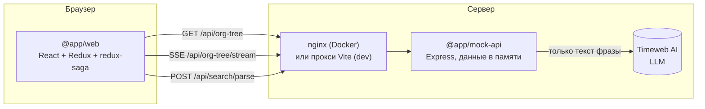
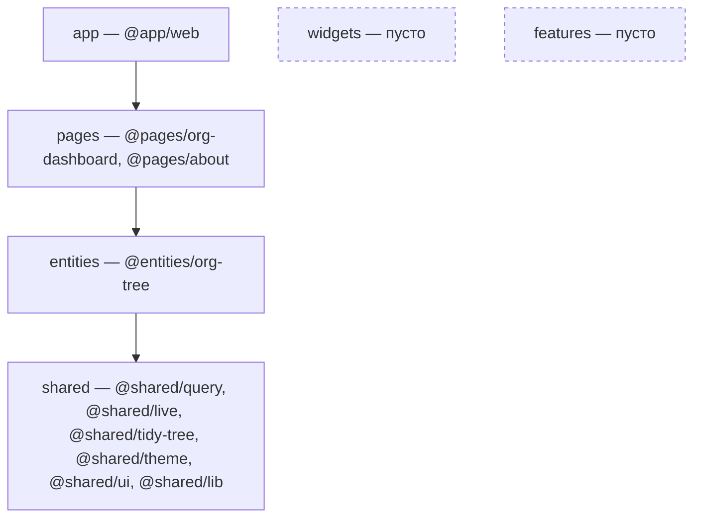
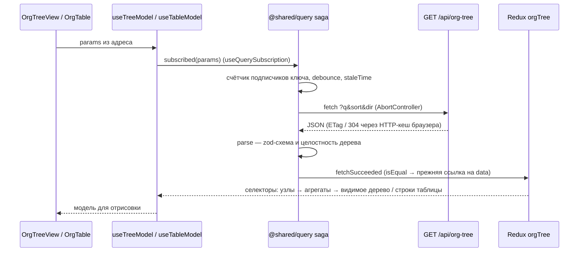
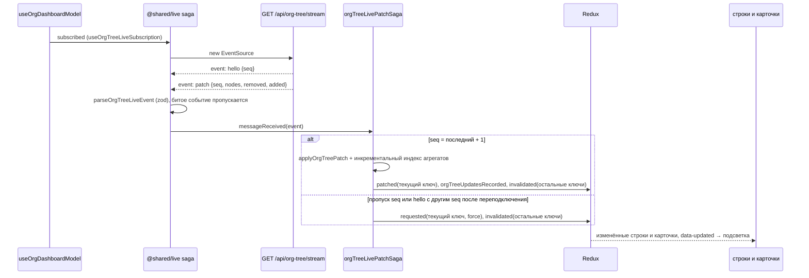
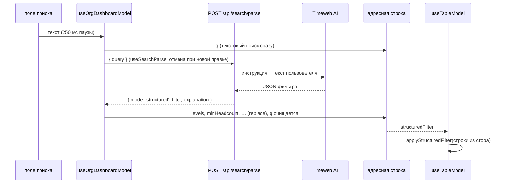

# Архитектура

Как устроено приложение: из каких частей состоит, где проходят границы и как данные идут от
мок-сервера до компонентов. Модель данных, алгоритм агрегации и контракт потока патчей —
в [data-model.md](data-model.md), причины ключевых решений — в [adr/](adr/).

## Части системы

| Часть                | Что делает                                                                                                       |
| -------------------- | ---------------------------------------------------------------------------------------------------------------- |
| `apps/web`           | SPA: роутер, провайдеры, сборка стора и корневой саги из того, что экспортируют пакеты                           |
| `packages/*/*`       | код приложения по слоям FSD, каждый пакет — одна функциональность                                                |
| `apps/mock-api`      | мок бэкенда: 53 узла из зашитого сида, поиск и сортировка, ETag/304, поток патчей (SSE), разбор фразы моделью    |
| `scripts/mutation`   | мутационная проверка: ломает код и убеждается, что тесты падают                                                  |
| `scripts/size`       | бюджет размера сборки клиента (gzip)                                                                             |
| `docker-compose.yml` | `web` (nginx со статикой, прокси `/api`) → `api` (мок-сервер); одноразовый `stream-autostart` включает генерацию |

Окружения:

- **dev** — `npm run dev`: Vite на :5173 проксирует `/api` на мок-сервер :3001.
- **Docker** — `docker compose up --build`: nginx на :8080 отдаёт предсжатую статику и
  проксирует `/api` (для SSE — без буферизации) в контейнер `api`.

Клиент в обоих случаях ходит на относительный `/api`: адрес сервера в сборку не зашит.

## Слои приложения

Монорепозиторий на npm workspaces. **Слой FSD — это группа пакетов** (`packages/<слой>/`),
**пакет внутри слоя — одна функциональность** с именем `@<слой>/<функциональность>` и
публичным API через `exports` ([ADR-001](adr/001-fsd-layers-as-package-groups.md)).

| Слой     | Пакет                  | Ответственность                                                                                                                                                            |
| -------- | ---------------------- | -------------------------------------------------------------------------------------------------------------------------------------------------------------------------- |
| app      | `@app/web`             | `createBrowserRouter`, `Provider` стора и темы, `combineSlices` из слайсов пакетов, реестр саг под `supervise` (упавшая сага перезапускается, соседние не останавливаются) |
| pages    | `@pages/org-dashboard` | страница: параметры в адресе, режимы просмотра, раскрытие и выделение, связь дерева и таблицы, AI-поиск, индикатор соединения                                              |
| pages    | `@pages/about`         | вторая страница — для проверки подписок и кеша при навигации                                                                                                               |
| widgets  | —                      | виджет агрегирует фичи; фич нет, слой пуст                                                                                                                                 |
| features | —                      | фича агрегирует сущности; сущность одна, слой пуст                                                                                                                         |
| entities | `@entities/org-tree`   | оргдерево целиком: схема и запрос, поток и применение патчей, селекторы, агрегаты, модели-хуки, UI дерева (холст, карточка) и таблицы                                      |
| shared   | `@shared/query`        | многоключевой кеш stale-while-revalidate на redux-saga ([ADR-002](adr/002-query-cache-on-redux-saga.md))                                                                   |
| shared   | `@shared/live`         | источник событий сервера: соединение `EventSource` с подписчиками, повторами и состоянием в сторе                                                                          |
| shared   | `@shared/tidy-tree`    | раскладка дерева (только числа, без DOM и React)                                                                                                                           |
| shared   | `@shared/theme`        | тема styled-components: размеры, цвета, пороги эффективности, длительности анимаций                                                                                        |
| shared   | `@shared/ui`, `lib`    | заготовки                                                                                                                                                                  |

Правила закреплены линтером:

- слой импортирует только нижележащие слои (`no-restricted-imports` по скоупу `@<слой>/*`);
- пакет импортирует только объявленное в своём `package.json` (`import/no-extraneous-dependencies`);
- внутренности пакета закрыты `exports`: `@entities/org-tree/src/...` не резолвится;
- страницам запрещены `react-redux`, `redux-saga`, `@reduxjs/toolkit`: со стором они работают
  только через хуки сущности;
- пакеты не читают `import.meta.env` и не измеряют DOM; инлайн-стили запрещены.

Внутри пакета сущности — сегменты `api/` (сетевой вызов), `model/` (схема, стор, саги,
селекторы, хуки-модели), `lib/` (чистые вычисления для UI), `ui/` (компоненты). Состояние и
логика компонента живут в хуке модели рядом с ним, компонент только рендерит.

## Где живёт состояние

| Состояние                                                  | Где                                                  | Почему                                                                                 |
| ---------------------------------------------------------- | ---------------------------------------------------- | -------------------------------------------------------------------------------------- |
| ответы API по ключам параметров, статусы запросов          | Redux, `orgTree` (`@shared/query`)                   | серверные данные, общие для дерева и таблицы                                           |
| состояние соединения потока (`status`, `lastSeq`, попытки) | Redux, `orgTreeLive` (`@shared/live`)                | индикатор соединения                                                                   |
| номера патчей, изменивших значения узлов                   | Redux, `orgTreeUpdates`                              | подсветка обновлений без таймеров                                                      |
| индекс агрегатов                                           | `WeakMap` по ссылке на массив узлов                  | производное от данных, не сериализуется ([ADR-005](adr/005-incremental-aggregates.md)) |
| `q`, `sort`, `dir`, `view`, структурный фильтр             | адресная строка                                      | ссылкой можно поделиться ([ADR-006](adr/006-url-as-source-of-truth.md))                |
| раскрытие, выделение                                       | состояние React страницы                             | состояние работы с экраном, в ссылку не входит                                         |
| черновик поля поиска                                       | состояние React в `useTableModel`                    | меняется на каждое нажатие, в адрес уходит после паузы                                 |
| панорама и зум во время жеста                              | ref + `requestAnimationFrame`, в состояние — в конце | критический путь рендеринга ([ADR-007](adr/007-tree-layout-and-canvas.md))             |

## Поток данных: загрузка

1. **Параметры.** `useOrgDashboardParams` читает `q`, `sort`, `dir`, `view` из адреса на каждом
   рендере. Дерево и таблица получают одни и те же `params` — значит, один ключ кеша и один
   запрос.
2. **Подписка.** `useOrgTree(params)` → `useQuerySubscription` диспатчит `subscribed(params)` при
   монтировании и смене ключа, `unsubscribed` — при размонтировании. Хук запросов не делает.
3. **Решение о запросе** принимает сага `@shared/query`: у ключа есть подписчики, запроса по нему
   нет, данные старше `staleTime` (5 с). По каждому ключу не больше одного запроса; уход последнего
   подписчика отменяет запрос через `AbortController`; запись без подписчиков удаляется через
   `gcTime` (5 мин).
4. **Запрос.** `fetchOrgTree` — `GET /api/org-tree?q=&sort=&dir=`. Сервер всегда отдаёт все узлы;
   от параметров зависят только `matches` и `order`. ETag и 304 обрабатывает HTTP-кеш браузера.
5. **Валидация.** `parseOrgTree` — строгая zod-схема и целостность дерева. Нарушение — ошибка
   всего ответа (`status: 'error'`), частичных данных нет.
6. **Запись.** Если ответ равен текущим данным ключа (`isSameOrgTree`: тот же набор id и
   `updatedAt`), в стор уходит только `fetchedAt`, ссылка на `data` прежняя — компоненты не
   перерисовываются. Пока у нового ключа нет данных, селектор отдаёт данные прежнего с
   `isPlaceholder: true`.
7. **Селекторы** (`createSelector`, мемоизация по ссылке на `data`):
   - `selectOrgNodes` → `selectChildrenIndex`, `selectParentIndex`, `selectNodeLevels` — индексы
     структуры;
   - `selectSubtreeAggregates` — итоги поддеревьев, один расчёт на данные для дерева и таблицы;
   - `selectVisibleTree(params, expandedIds)` — узлы раскрытых ветвей с итогами;
   - `selectTableRows(params)` — строки, сгруппированные по иерархии, в порядке `order`.
8. **Модели-хуки.**
   - `useTreeModel` — видимое дерево → раскладка `@shared/tidy-tree` → `TreeCanvas` (SVG,
     карточки `OrgNodeCard` в `foreignObject`).
   - `useTableModel` — строки → `applyStructuredFilter` (если задан фильтр AI-поиска) →
     `OrgTable` / `OrgTableRow`.
9. **Страница** (`useOrgDashboardModel`) связывает дерево и таблицу: выбор строки раскрывает
   предков и доводит холст до узла, выбор узла прокручивает таблицу к строке.

## Поток данных: обновления в реальном времени

1. **Соединение.** Страница вызывает `useOrgTreeLiveSubscription`. Сага `@shared/live` держит
   счётчик подписчиков: первый открывает `EventSource`, последний закрывает. Обрыв —
   `connectionLost` и повтор через экспоненциальную паузу с джиттером (1 с … 30 с, до 10 попыток
   подряд); возврат вкладки на экран — попытка сразу. Встроенный повтор браузера не
   используется: источник закрывается на первой ошибке, повторами управляет сага.
2. **Разбор.** Каждое событие проходит строгую схему; битое событие логируется и пропускается,
   соединение остаётся.
3. **Порядок.** `orgTreeLivePatchSaga` помнит `seq` последнего учтённого события и параметры
   последней подписки UI. Повтор (`seq` ≤ последнего) игнорируется, пропуск — полный перезапрос
   текущего ключа ([ADR-004](adr/004-live-patches-into-query-cache.md)).
4. **Применение.** `applyOrgTreePatch` строит новый массив узлов (нетронутые узлы — прежние
   ссылки), пересчитывает индекс агрегатов только по цепочкам предков изменённых узлов и
   вычисляет, какие показанные значения изменились. Индекс кладётся в `WeakMap` до записи данных
   в стор — селектор находит готовый и полного расчёта не запускает.
5. **Стор.** `patched(params, updater)` меняет данные текущего ключа без запроса;
   `orgTreeUpdatesRecorded` записывает номер патча для изменённых значений;
   `invalidated(predicate)` помечает протухшими остальные ключи: их `matches` и `order` считает
   сервер.
6. **UI.** Структура не менялась — индексы детей и родителей сохраняют ссылки, раскрытие и
   раскладка не пересчитываются. Перерисовываются строка узла, его карточка и карточки
   предков; элемент со свежим номером патча получает `data-updated`, CSS-анимация фона гаснет
   за 1.5 с.

На сервере изменения делают дев-ручки: `POST /api/dev/touch`, `/api/dev/stream/emit` и генерация
по таймеру после `/api/dev/stream/start` (в Docker включается автоматически). Каждое изменение
применяется к данным в памяти и рассылается всем подписчикам с новым `seq`.

## Поток данных: AI-поиск

- Модель получает только текст фразы и постоянную инструкцию — данных оргструктуры в запросе
  нет. Ключ `LLM_API_KEY` есть только у сервера.
- Ответ модели проверяется zod-схемой; сбой, таймаут или невалидный ответ — `mode: 'text'`,
  работает обычный поиск по названию.
- Сервер кэширует удачные разборы по нормализованному тексту: это перевод фразы в условия, он не
  зависит от данных.
- Фильтр применяется на клиенте к строкам из стора — тем же, что обновляют патчи, поэтому
  результат фильтра следует за живыми данными
  ([ADR-008](adr/008-ai-search-structured-filter.md)).

## Ошибки и устойчивость

| Сбой                                   | Поведение                                                                                 |
| -------------------------------------- | ----------------------------------------------------------------------------------------- |
| сеть или HTTP-ошибка при загрузке      | `status: 'error'`, данные прежние (если были), «Повторить» — `requested({ force: true })` |
| ответ нарушает контракт                | ошибка всего ответа (`OrgTreeContractError`), частичных данных нет                        |
| отмена запроса (уход со страницы)      | статус «как до запроса», ошибкой не считается                                             |
| обрыв потока                           | повторы с джиттером; после 10 неудач — `failed`, кнопка «Подключиться»                    |
| битое событие потока                   | событие пропускается, соединение остаётся                                                 |
| пропущенные патчи                      | полный перезапрос текущего ключа                                                          |
| исключение в саге пакета               | `supervise` перезапускает её через 1 с; остальные саги работают                           |
| модель недоступна или ответила мусором | текстовый поиск                                                                           |
